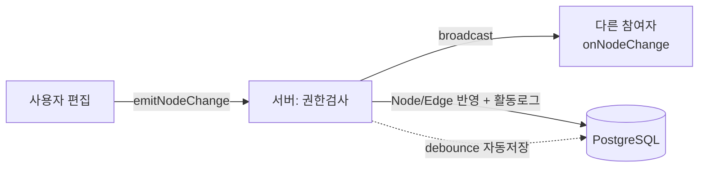

# MarkFlow 기획서

| 항목 | 내용 |
| --- | --- |
| 문서 유형 | 기획서 |
| 프로젝트 | MarkFlow — 마크다운 노드 기반 실시간 협업 캔버스 |
| 버전 / 상태 | v1.2 / Draft (설계 산출물 정합성 반영) |
| 팀 / 기간 | 4인 / 4주 |
| 작성일 | 2026-06-24 |

> 한 줄 정의 — FigJam식 무한 캔버스 위에서 스티키 메모 대신 마크다운(.md) 노드를 작성하고, 노드끼리 연결해 아이디어 흐름도를 만드는 실시간 협업 툴.

---

## 1. 프로젝트 개요

### 1.1 기획 배경

- 기존 협업 화이트보드(FigJam, Miro)의 스티키 노트는 한 칸에 담을 수 있는 정보 밀도가 낮아, 정리된 문서로 이어가기 어렵다.
- 개발자·기획자는 마크다운에 익숙하지만, 화이트보드 도구는 코드 블록·제목·리스트 같은 구조적 텍스트 표현이 약하다.
- 아이디어를 '흐름'으로 연결하면서도, 각 노드 안에는 충분히 풍부한 문서를 담고 싶은 니즈가 있다.
- 결국 '브레인스토밍 단계의 가벼움'과 '문서의 밀도'를 한 화면에서 오가는 도구가 비어 있다.

### 1.2 목적 및 목표

- 제품 목표 — 마크다운 문서 노드 + 흐름 연결 + 실시간 협업을 하나의 캔버스로 통합한다.
- 프로젝트 목표 — 4주 / 4인 팀으로 핵심 기능(MVP)을 완성하고, 실시간 협업을 데모 하이라이트로 시연한다.
- 학습 목표 — React Flow 기반 캔버스, Socket.io 실시간 동기화, 권한·저장 백엔드를 직접 설계·구현한다.

---

## 2. 타겟 사용자 및 문제 정의

### 2.1 타겟 사용자

| 사용자 | 사용 맥락 |
| --- | --- |
| 개발 팀 | 기능 명세·아키텍처 설계를 노드로 쪼개고 흐름으로 연결 |
| 기획 / PM | 아이디어 정리, 유저 플로우·기능 흐름 설계 |
| 스터디 · 팀 프로젝트 | 여러 명이 동시에 아이디어를 모으고 문서로 정리 |

### 2.2 핵심 문제와 해결

| 기존 도구의 한계 | MarkFlow의 해결 |
| --- | --- |
| 스티키 노트는 텍스트 밀도가 낮다 | 노드 = .md 파일, 접기/펼치기로 요약↔상세 전환 |
| 문서 도구는 '흐름'을 시각화하기 어렵다 | 노드를 엣지로 연결해 아이디어 흐름도 구성 |
| 실시간 협업 시 누가 뭘 하는지 모른다 | 멀티커서·소프트 락·채팅으로 작업 가시화 |
| 정리된 결과물을 보관·관리하기 번거롭다 | 휴지통·팀 레포 export로 라이프사이클 관리 |

---

## 3. 핵심 차별점

MarkFlow는 '브레인스토밍 도구'와 '문서 도구' 사이의 빈자리를 노린다. 네 가지 축이 차별점을 만든다.

1. 정보 밀도 — 메모지가 곧 .md 파일. 접으면 제목+요약 한 줄, 펼치면 코드·표·리스트까지 담긴 상세 문서.
2. 흐름의 시각화 — 노드 연결의 화살표 방향이 곧 아이디어 흐름. 흩어진 메모가 플로우차트가 된다.
3. 실시간 협업 — Figma처럼 누가 어디서 작업 중인지 보이고, 같은 캔버스에서 동시에 채팅하며 일한다.
4. AI 보조 (확장) — 주제만 주면 노드 초안을 만들어 주고, 캔버스 안에서 바로 상담형 챗봇을 쓸 수 있다.

---

## 4. 핵심 기능

### 4.1 캔버스 & 노드 (핵심 기능 · MVP)

MarkFlow의 정체성. 마크다운 노드를 작성하고, 노드끼리 연결해 흐름도를 만든다.

- 마크다운 노드 — React Flow 커스텀 노드 안에 마크다운 에디터를 끼워넣는다. 펼치면 에디터 전체, 접으면 제목+요약 한 줄.
- 노드 연결 — onConnect 콜백에서 엣지를 생성해 흐름도·플로우차트를 구성. 화살표 방향이 아이디어 흐름.
- 무한 캔버스 — 팬/줌·미니맵·fitView 등 React Flow 기본 기능으로 전체 흐름 조망.
- 직렬화 — `{ nodes, edges }` 를 JSON으로 만들면 그대로 저장·동기화 단위가 된다.

> 난이도: 중. 무거운 일은 React Flow가 대신해, 구현은 커스텀 노드 컴포넌트 하나에 집중된다.

### 4.2 실시간 협업 (하이라이트)

멀티커서 + 노드 동시 작업 + 채팅. 가장 어렵고 가장 인상적인 부분.

설계 원칙 — 실시간 구현체를 컴포넌트에 직접 박지 않고, 공통 인터페이스(useCollaboration 훅) 뒤에서 Socket.io / Liveblocks를 갈아끼운다. '직접 구현하다 막히면 차선책으로 전환'을 가능하게 하는 핵심 결정.

1순위(Socket.io 직접 구현)

- 룸: 캔버스 1개 = Socket.io room 1개.
- 초기 싱크: 접속 시 서버가 DB의 현재 상태를 init 이벤트로 내려줌.
- 멀티커서: cursor:move 좌표 broadcast, throttle(약 50ms)로 트래픽 절감.
- 노드/엣지 동기화: add·update·move·delete 이벤트 broadcast. 노드 단위라 충돌이 적어 last-write-wins로 충분.
- 소프트 락: 한 노드는 한 번에 한 명만 편집. lock/unlock으로 'OO 편집 중' 표시 → CRDT 없이 동시편집 충돌을 통째로 회피.
- 채팅: 프로젝트(캔버스) 단위 메시지 broadcast + DB 저장 / 재접속: 끊김 복구 시 init 재수신.

> 잔버그 포인트 3가지 — ① 늦게 들어온 사람 초기 싱크 ② 끊김 재접속 ③ 이벤트 순서 꼬임. 이 셋만 잡으면 안정적.

차선책(Liveblocks) — 막히거나 시간이 부족하면 같은 CollabAPI 뒤에 Liveblocks를 꽂는다. RoomProvider·useOthers·useStorage로 충돌·프레즌스를 대신 처리해 구현량이 확 줄어든다.

### 4.3 파일 & 저장 시스템

- 캔버스 저장 — 캔버스 본문을 **Node/Edge 테이블로 정규화** 저장(결정). 프론트의 `{ nodes, edges }`는 정규화 row를 조합해 만든 형태이며, 저장은 노드/엣지 단위로 이뤄진다. debounce 자동 저장(약 2초) + 수동 저장 버튼. *(JSONB 통째 저장은 폐기 — 실시간 동기화·휴지통·활동 로그를 노드 단위로 다루기 위함)*
- 휴지통 — 물리 삭제 대신 deletedAt 타임스탬프로 소프트 삭제. 아코디언 리스트에서 복구(deletedAt → null) 또는 **영구 삭제**(물리 삭제, 복구 불가). 캔버스 노드 휴지통 + 프로젝트 휴지통 페이지.
- 팀 레포 export — 안전(1순위): 노드 .md를 묶어 ZIP 다운로드 / 욕심(여유 시): GitHub OAuth + Octokit으로 레포 커밋.

### 4.4 권한 관리 (소유자 / 에디터 / 뷰어)

| 역할 | 권한 |
| --- | --- |
| 소유자 (Owner) | 프로젝트 생성자. 이름 변경·삭제, 멤버 초대·권한 지정 포함 전체 권한 |
| 에디터 (Editor) | 노드 추가·수정·삭제(휴지통), 채팅 가능. 프로젝트 삭제·이름 변경·권한 관리 불가 |
| 뷰어 (Viewer) | 읽기 전용. 캔버스·채팅 열람만, 모든 변경 이벤트 거부 |

- 권한 검사는 REST와 Socket 이벤트 양쪽 서버에서 모두 수행한다. 프론트 버튼 비활성화는 UX용이며, 진짜 가드는 서버.
- 프로젝트 삭제·이름 변경·권한 지정은 소유자만 가능하다.

### 4.5 AI 기능 (확장 · 차별화 포인트)

필수는 아니지만, 시간이 허락하면 데모의 임팩트를 키우는 확장 기능. FigJam AI만큼 정교하지 않아도 '초안 수준'이면 충분하다.

- AI 노드 초안 작성 — 노드에 주제 한 줄을 입력하면 마크다운 초안(제목·요약·하위 항목)을 자동 생성. 백엔드 프록시(/api/ai/draft)가 LLM API를 호출하고 API 키는 서버에만 둔다.
- AI 챗봇(상담형) — 캔버스 사이드 패널에서 사용법·아이디어 정리를 도와주는 상담형 챗봇. 채팅 UI 재사용.

> 우선순위 — AI는 MVP 이후 '추가 점수' 영역. 핵심 기능이 안정화된 뒤 초안 생성 → 챗봇 순으로 붙이는 것을 권장.

---

## 5. 기술 스택

| 레이어 | 기술 | 역할 |
| --- | --- | --- |
| 프론트엔드 | React + TypeScript + Vite | 앱 베이스 |
| 캔버스 | React Flow (@xyflow/react) | 노드·엣지·줌/팬 |
| 마크다운 | @uiw/react-md-editor | 노드 내부 .md 작성/렌더 |
| 상태관리 | Zustand | nodes/edges 전역 상태 |
| 스타일 | Tailwind CSS | UI |
| 백엔드 | Node.js + Express | REST API |
| 실시간 (1순위) | Socket.io | 룸·동기화·커서·채팅 |
| 실시간 (차선) | Liveblocks | 막힐 경우 대체 |
| DB | PostgreSQL + Prisma | 유저·프로젝트·노드/엣지·채팅·활동 로그 저장 |
| 인증 | JWT (이메일/비밀번호) | 로그인 |
| AI (확장) | LLM API + 서버 프록시 | 노드 초안·챗봇 |

> 저장 전략 — 캔버스 본문은 **Node/Edge 테이블로 정규화**한다(결정). 노드 단위로 실시간 동기화·소프트 락·휴지통·활동 로그를 다루기 위함이며, Socket.io 이벤트와 row 단위로 매끄럽게 매핑된다. (초기 검토안의 JSONB 통째 저장은 폐기.)

---

## 6. 시스템 구조 & 데이터 흐름

실시간 추상화 레이어 — 컴포넌트는 useCollaboration 훅(CollabAPI)만 바라본다. 내부에서 useSocketCollab() 또는 useLiveblocksCollab() 중 하나를 선택하므로, 구현체를 통째로 교체해도 UI 코드는 그대로다.

데이터 흐름

1. 사용자가 노드를 편집 → emitNodeChange로 서버에 송신
2. 서버가 권한 검사 후 같은 룸에 broadcast + DB(Node/Edge row) 반영 + 활동 로그 기록
3. 다른 참여자는 onNodeChange로 수신해 화면 갱신 (last-write-wins)
4. debounce 자동 저장으로 캔버스 변경을 주기적으로 영속화

---

## 7. 개발 일정 (4주)

| 주차 | 목표 | 주요 작업 |
| --- | --- | --- |
| 1주차 | 인증 + 프로젝트 + 캔버스 기본 | JWT 회원가입/로그인, 프로젝트 CRUD, React Flow 노드·연결 |
| 2주차 | MD 노드 + 저장 + 휴지통 | 마크다운 상세보기, Node/Edge 정규화 저장, 소프트 삭제·복구·영구삭제 |
| 3주차 | 실시간 협업 | 멀티커서·노드 동기화·소프트 락·채팅 (막히면 Liveblocks) |
| 4주차 | 확장·통합·발표 | Node 히스토리, (여유 시) AI·export, 통합 테스트·데모 |

> 진행 순서 원칙 — ① 캔버스+노드(정체성) → ② 저장+휴지통(안정적 CRUD) → ③ 실시간(하이라이트). 실시간 안에서는 멀티커서 → 노드 동기화 → 소프트 락 → 채팅 순.

---

## 8. 역할 분담 (4인)

| 담당 | 역할 | 주요 책임 |
| --- | --- | --- |
| A | 실시간 전담 | Socket.io 서버, 룸·동기화·락 로직, 막히면 Liveblocks 차선책 |
| B | 캔버스 | React Flow 캔버스, 노드 연결, 무한 캔버스 컨트롤 |
| C | 노드 UX | md 노드 에디터, 접기/펼치기, 락 UI, 채팅 UI |
| D | 저장·권한·통합 | 저장/export/휴지통, 권한 시스템, 통합·발표 |

> 데모 안전장치 — A가 Socket.io에서 막히면, D가 동일한 CollabAPI 뒤에 Liveblocks 차선책을 병렬로 준비한다.

---

## 9. 우선순위 & 리스크 관리

### 9.1 우선순위

1. 반드시(MVP) — 캔버스 + md 노드 + 연결. 흐름도 완성이 곧 MarkFlow의 정체성.
2. 그다음 — 저장 + 휴지통 + 인증. 안정적인 CRUD로 점수 확보.
3. 하이라이트 — 실시간(Socket.io 직접, 막히면 Liveblocks).
4. 확장 — Node 히스토리, AI 초안·챗봇, GitHub export.

### 9.2 리스크 & 대응

| 리스크 | 대응 방안 |
| --- | --- |
| 실시간 동기화 디버깅이 길어짐 | 추상화 레이어로 Liveblocks 차선책 병렬 준비, 일정 3주차로 고정 |
| 동시 텍스트 편집 충돌(CRDT 부담) | 소프트 락으로 한 노드 한 명 편집 — 충돌 자체를 회피 |
| 권한 우회(프론트만 차단) | REST·Socket 양쪽 서버 가드 의무화 |
| AI 범위가 커져 일정 압박 | AI는 최후순위, 출력 범위를 '초안 수준'으로 제한 |
| 초기 싱크·재접속 버그 | init 이벤트 1순위 구현, 끊김 복구 시 상태 재동기화 |

---

## 10. 기대 효과

- 브레인스토밍의 가벼움과 문서의 밀도를 한 화면에서 오가는, 비어 있던 협업 도구 경험 제공.
- 실시간 동기화·권한·저장까지 풀스택을 직접 설계·구현하는 팀 학습 성과.
- Socket.io 직접 구현 + 차선책 추상화로, 데모 안정성과 기술 난이도(발표 점수)를 동시에 확보.
- AI 확장으로 추가 차별화 여지 — 초안 자동 생성·캔버스 기반 챗봇.

---

## 관련 문서

- PRD (제품 요구사항 정의서)
- 데이터 모델(ERD)
- API 명세서
- 화면설계서(Figma)
- 기술 설명서(Tech Spec)
