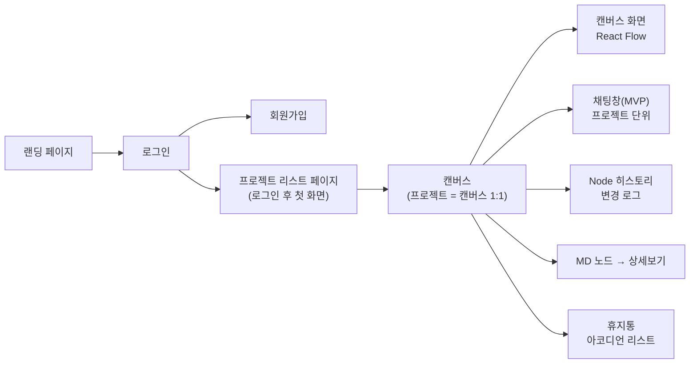

# MarkFlow PRD (제품 요구사항 정의서)

| 항목 | 내용 |
| --- | --- |
| 문서 유형 | PRD — 팀 화면 구성도(IA) 기준 |
| 프로젝트 | MarkFlow — 마크다운 노드 기반 실시간 협업 캔버스 |
| 버전 / 상태 | v1.3 / Confirmed (설계 산출물 정합성 반영) |
| 팀 / 기간 | 3인 / 4주 |
| 작성일 | 2026-06-24 |

> 한 줄 정의 — FigJam식 무한 캔버스 위에서 스티키 메모 대신 마크다운(.md) 노드를 작성하고, 노드끼리 연결해 아이디어 흐름도를 만드는 실시간 협업 툴.

---

## 0. 핵심 결정 사항 (Decision Log)

이전 미해결 항목은 아래와 같이 확정됨. 모든 요구사항은 이 결정을 기준으로 한다.

| # | 항목 | 결정 |
| --- | --- | --- |
| 1 | 권한 모델 | 3분류: 소유자(Owner) / 에디터(Editor) / 뷰어(Viewer) |
| 2 | 프로젝트 ↔ 캔버스 | 프로젝트 = 캔버스 (1:1) |
| 3 | 변경 히스토리 | 활동 로그(ActivityLog)만 — 누가·언제·무엇에·무슨 액션. 노드뿐 아니라 엣지 연결·프로젝트 이름변경도 한 타임라인에 기록. 내용 복원/diff는 범위 밖 |
| 4 | 실시간 협업 | 포함 (멀티커서·노드 동기화·소프트 락). **구현 정본 = Socket.io 직접 구현**, Liveblocks는 CollabAPI 추상화 뒤 차선책 |
| 5 | 인증 | JWT 자체 구현 (이메일 / 비밀번호). 액세스 토큰만 사용(stateless), RefreshToken 미채택 |
| 6 | 채팅 범위 | 프로젝트(캔버스) 단위 채팅 |
| 7 | 임시 저장소 / 휴지통 | 하나로 통합 (소프트 삭제 + 휴지통 복구 + 영구 삭제) |
| 8 | 캔버스 저장 | 캔버스 본문은 Node/Edge 테이블로 **정규화**(JSONB 통째 저장 아님) |

---

## 1. 개요

### 1.1 문제 정의

- 화이트보드의 스티키 노트는 정보 밀도가 낮아 정리된 문서로 잇기 어렵다.
- 문서 도구는 '아이디어 흐름'을 시각적으로 잇기 어렵다.
- 실시간 협업 시 누가 무엇을 작업 중인지 알기 어렵다.

### 1.2 목표 (Goals)

- 마크다운 노드 + 흐름 연결 + 실시간 협업을 하나의 캔버스로 통합한다.
- 4주 안에 MVP를 완성하고 데모로 시연한다.

### 1.3 비목표 (Non-Goals)

- CRDT 기반 글자 단위 동시 편집은 범위 밖이다. (소프트 락으로 대체)
- 모바일 전용 UI, 오프라인 동기화는 포함하지 않는다.
- AI 기능은 필수가 아닌 확장 영역이다.

### 1.4 성공 지표 (데모 기준)

- MVP 핵심 흐름(회원가입 → 프로젝트 생성 → 캔버스 노드 작성·연결 → 저장)이 오류 없이 동작한다.
- 2인 이상 동시 접속 시 커서·노드 변경이 약 1초 이내로 반영된다.

---

## 2. 사용자 & 핵심 시나리오

| 페르소나 | 니즈 |
| --- | --- |
| 개발자 / 팀 리드 | 코드 블록까지 담기는 밀도 있는 노드, 흐름 연결 |
| 기획자 / PM | 무한 캔버스에서 유저 플로우·기능 흐름 정리 |
| 스터디 / 팀원 | 멀티커서·채팅으로 실시간 협업 |

핵심 시나리오: 로그인 → 프로젝트 리스트에서 프로젝트 생성/선택 → 캔버스에서 마크다운 노드 작성·연결 → 멀티커서·채팅으로 협업 → 삭제 항목은 휴지통에서 복구.

---

## 3. 사이트맵 / 화면 구조

팀 화면 구성도 기준.

- 공용 컴포넌트 (전 화면 공통)
    - 헤더 — 네비, 회원(로그인 / 로그아웃)
    - 푸터
    - 채팅창 (캔버스 진입 시 활성, 프로젝트 단위)
- 랜딩 페이지
    - 랜딩 이미지
    - 페이지 소개글 (부록 A 초안)
    - 푸터
- 로그인
    - 회원가입
- 프로젝트 리스트 페이지 (로그인 후 첫 화면)
    - 프로젝트 리스트
    - 프로젝트 생성 / 삭제
    - 소유자만 이름 변경
- 캔버스 (프로젝트 진입, 프로젝트 1개 = 캔버스 1개)
    - 1. 캔버스 화면 (React Flow)
    - 2. 채팅창 기능 (MVP 채팅, 프로젝트 단위)
    - 3. Node 히스토리 (변경 로그)
    - 4. MD 파일 — 노드 → 상세보기 (마크다운 에디터 상세보기)
    - 5. 휴지통 → 아코디언 형식 휴지통 리스트

---

## 4. 화면별 기능 요구사항

우선순위: P0 = MVP 필수 / P1 = 핵심 / P2 = 확장. 수용 기준은 체크박스로 표기.

### 4.0 공용 컴포넌트 — P0

- [ ] 헤더에 네비게이션과 로그인 상태(로그인/로그아웃)가 표시된다
- [ ] 푸터가 전 화면 공통으로 노출된다
- [ ] 채팅창은 캔버스(프로젝트) 진입 시 활성화되며, 같은 프로젝트 참여자끼리 대화한다

### 4.1 랜딩 페이지 — P1

- [ ] 랜딩 이미지가 표시된다
- [ ] 서비스 소개글이 표시된다 (부록 A 초안)
- [ ] 푸터가 표시되고, 헤더에서 로그인으로 이동할 수 있다

### 4.2 로그인 / 회원가입 — P0

인증은 JWT 자체 구현(이메일 / 비밀번호).

- [ ] 이메일 / 비밀번호로 회원가입을 할 수 있다 (비밀번호는 해시 저장)
- [ ] 로그인 성공 시 JWT를 발급받고 프로젝트 리스트 페이지로 이동한다
- [ ] 비로그인 사용자는 프로젝트 / 캔버스에 접근할 수 없다
- [ ] 토큰 만료/무효 시 로그인 화면으로 리다이렉트된다

### 4.3 프로젝트 리스트 페이지 — P0

로그인 후 첫 화면. 프로젝트 = 캔버스 1:1.

- [ ] 내가 소유하거나 참여한 프로젝트 목록이 보인다
- [ ] 프로젝트를 생성하면 캔버스가 함께 생성된다
- [ ] 프로젝트(=캔버스)를 삭제할 수 있다 (소유자)
- [ ] 프로젝트 소유자만 이름을 변경할 수 있다
- [ ] 프로젝트를 선택하면 해당 캔버스로 진입한다

### 4.4 캔버스

#### 4.4.1 캔버스 화면 (React Flow) — P0

- [ ] 노드를 생성·이동·삭제할 수 있다
- [ ] 두 노드를 엣지로 연결할 수 있고 화살표 방향이 표시된다
- [ ] 무한 캔버스에서 팬/줌, 미니맵, 전체보기(fitView)가 동작한다
- [ ] 캔버스 상태를 `{ nodes, edges }` JSON으로 직렬화·저장한다 (약 2초 debounce 자동 저장 + 수동 저장)

#### 4.4.2 MD 파일 노드 + 상세보기 — P0

- [ ] 노드는 마크다운(.md)으로 작성된다
- [ ] 노드를 접으면 제목+요약, 펼치면 내용이 보인다
- [ ] 노드 상세보기에서 마크다운 에디터로 상세 편집/렌더한다 (제목·리스트·코드 블록 지원)

#### 4.4.3 채팅창 기능 (MVP 채팅) — P1

- [ ] 같은 프로젝트(캔버스) 참여자끼리 메시지를 주고받는다
- [ ] 메시지가 저장되고 재접속 시에도 보인다

#### 4.4.4 변경 히스토리 (활동 로그) — P1

변경 이력을 활동 로그(ActivityLog)로 확인한다. 내용 복원/diff는 범위 밖.

- [ ] 노드 변경(생성/수정/이동/삭제/복원), **엣지 연결/해제**, **프로젝트 이름변경** 시점·작성자·액션이 기록된다
- [ ] 노드별 히스토리를 시간순으로 열람할 수 있다 (활동 로그를 노드 기준으로 필터)
- [ ] 프로젝트 전체 타임라인(우측 패널 히스토리 탭)을 시간 역순으로 열람할 수 있다

#### 4.4.5 휴지통 — P1

임시 저장소와 휴지통은 하나의 휴지통 개념으로 통합.

- [ ] 삭제된 노드/프로젝트는 물리 삭제 대신 휴지통으로 이동한다 (소프트 삭제, deletedAt)
- [ ] 휴지통 리스트가 아코디언 형식으로 펼쳐진다 (캔버스 노드 휴지통 + 프로젝트 휴지통 페이지)
- [ ] 휴지통에서 항목을 복구할 수 있다 (deletedAt → null)
- [ ] 휴지통에서 항목을 영구 삭제할 수 있다 (물리 삭제, 복구 불가 — 확인 후)
- [ ] 노드를 휴지통으로 보내면 연결된 엣지는 함께 제거된다 (복구 시 엣지는 복원되지 않음)

---

## 5. 실시간 협업 (포함 확정)

프로젝트의 핵심. 화면도에는 별도 화면이 없지만 캔버스 화면 위에 오버레이로 구현한다.

- [ ] (P0) 같은 캔버스 접속자는 하나의 룸으로 묶인다
- [ ] (P0) 늦게 접속 시 현재 상태를 초기 동기화(init)로 받는다
- [ ] (P1) 다른 사용자의 커서가 실시간 표시된다
- [ ] (P1) 노드 추가/수정/이동/삭제가 타인 화면에 반영된다 (last-write-wins)
- [ ] (P1) 편집 중 노드는 소프트 락으로 'OO 편집 중' 표시된다
- [ ] (P1) 끊김 복구 시 상태가 재동기화된다

> 구현 메모 — **정본은 Socket.io 직접 구현**이다. 다만 실시간 구현체를 컴포넌트에 직접 박지 않고 공통 인터페이스(CollabAPI / `useCollaboration`) 뒤에 둬서, 막힐 경우 동일 인터페이스로 Liveblocks(차선)로 교체할 수 있게 한다. 커서는 약 50ms throttle. 채팅·캔버스는 분리하지 않고 같은 룸(`project:<id>`)에서 이벤트 이름으로 구분한다.

---

## 6. 권한 모델 (소유자 / 에디터 / 뷰어)

| 역할 | 권한 |
| --- | --- |
| 소유자 (Owner) | 프로젝트 생성자. 이름 변경·삭제, 멤버 초대·권한 지정 포함 전체 권한 |
| 에디터 (Editor) | 노드 추가·수정·삭제(휴지통), 채팅 가능. 프로젝트 삭제·이름 변경·권한 관리 불가 |
| 뷰어 (Viewer) | 읽기 전용. 캔버스·채팅 열람만 가능, 모든 변경 이벤트 거부 |

| 동작 | 뷰어 | 에디터 | 소유자 |
| --- | --- | --- | --- |
| 캔버스·채팅 열람 | O | O | O |
| 노드 추가·수정·이동 | X | O | O |
| 노드 삭제 (휴지통) | X | O | O |
| 채팅 메시지 작성 | X | O | O |
| 프로젝트 이름 변경·삭제 | X | X | O |
| 멤버 초대·권한 지정 | X | X | O |

- [ ] 역할은 소유자 / 에디터 / 뷰어 3가지다 (소유자는 프로젝트당 1명, 생성자)
- [ ] 프로젝트 삭제·이름 변경·권한 지정은 소유자만 가능하다
- [ ] 뷰어의 모든 변경 이벤트(노드·채팅)는 서버에서 거부된다
- [ ] 권한 검사는 REST와 Socket 이벤트 양쪽 서버에서 수행한다 (프론트 비활성화는 UX용)

---

## 7. 비기능 요구사항

| 분류 | 요구사항 |
| --- | --- |
| 성능 | 커서 throttle 약 50ms, 저장 debounce 약 2초, 변경 반영 약 1초 이내 |
| 보안 | 비밀번호 해시 저장, JWT 검증, 권한은 서버에서 확인 |
| 동시성 | 노드 단위 last-write-wins + 소프트 락 |
| 호환성 | 데스크톱 최신 Chrome 기준 |
| 안정성 | 끊김 재접속 시 상태 재동기화, 초기 싱크 보장 |

---

## 8. 기술 개요 & 데이터 엔티티

상세는 기술 설명서(Tech Spec) / 데이터 모델(ERD)에서 다룸.

스택: React + TypeScript + Vite, React Flow, @uiw/react-md-editor, Zustand, Tailwind / Node.js + NestJS, Socket.io(1순위)·Liveblocks(차선) / PostgreSQL + Prisma (Node/Edge 정규화) / JWT 인증.

확정 결정 기반 추정 엔티티 (ERD에서 확정):

| 엔티티 | 핵심 필드(예시) | 비고 |
| --- | --- | --- |
| User | id, email, passwordHash, name | JWT 인증 |
| Project | id, name, deletedAt | 프로젝트 = 캔버스 1:1, 소프트 삭제. 캔버스 본문은 Node/Edge로 정규화 |
| ProjectMember | projectId, userId, role | role = OWNER / EDITOR / VIEWER. 소유자(OWNER)는 프로젝트당 1명, 역할의 단일 소스 |
| Node | id, projectId, title, markdown, type, collapsed, posX/posY, deletedAt | 타입(idea/doc/task/decision/data), 휴지통용 deletedAt |
| Edge | id, projectId, sourceId, targetId | 노드 연결(중복·자기연결 금지) |
| ChatMessage | id, projectId, userId, content, createdAt | 프로젝트 단위 채팅 |
| ActivityLog | id, projectId, userId, targetType, targetId, action, createdAt | 활동 로그(폴리모픽: NODE/EDGE/PROJECT). 복원·diff 없음 |

> 캔버스 본문은 Node/Edge 테이블로 정규화한다(결정). 실시간 동기화·휴지통·활동 로그를 노드/엣지 단위로 다루기 위함. RefreshToken은 미채택(액세스 토큰만). 상세는 데이터 모델(ERD)·기술 설명서 참고.

---

## 9. 릴리스 계획 (4주 마일스톤)

| 주차 | 마일스톤 | 완료 기준 (DoD) |
| --- | --- | --- |
| 1주차 | 인증 + 프로젝트 리스트 + 캔버스 기본 | JWT 회원가입/로그인, 프로젝트 CRUD, 노드 작성·연결 |
| 2주차 | MD 노드 + 상세보기 + 저장 + 휴지통 | 마크다운 상세 편집, Node/Edge 저장, 소프트 삭제·복구 |
| 3주차 | 실시간 협업 + 채팅 | 멀티커서·노드 동기화·소프트 락·채팅 (막히면 Liveblocks) |
| 4주차 | Node 히스토리 + 통합 + 발표 | 변경 로그 열람, 통합 테스트, 데모 (여유 시 AI/랜딩 마감) |

---

## 10. 범위 밖 (Out of Scope)

- 글자 단위 동시 편집(CRDT)
- 에디터 삭제 시 소유자 승인 플로우 (필요 시 추후 추가)
- Node 히스토리의 내용 복원·diff
- 모바일 전용 UI / 오프라인 모드
- 외부 공개 공유 링크, 댓글 스레드
- AI 기능 (확장으로만, 여유 시 P2)

---

## 부록 A. 랜딩 페이지 소개글 초안

화면도의 '페이지 소개글 (클로드 알아서)'에 대한 제안 초안. 그대로 쓰거나 다듬어 사용.

메인 한 줄: 흩어진 아이디어를, 흐름으로.

소개 문단: MarkFlow는 마크다운 노드를 무한 캔버스 위에 자유롭게 펼치고 연결해, 팀이 실시간으로 함께 생각을 정리하는 협업 도구입니다. 스티키 메모보다 깊게, 문서보다 가볍게 — 접으면 요약, 펼치면 상세인 .md 노드로 아이디어의 밀도와 흐름을 동시에 잡으세요.

핵심 포인트(3개):

- 마크다운 노드 — 접으면 한 줄 요약, 펼치면 코드 블록까지 담는 상세 문서
- 흐름 연결 — 노드를 이어 아이디어를 플로우차트로
- 실시간 협업 — 같은 캔버스에서 함께 쓰고, 바로 대화

---

## 관련 문서

- 기획서
- 데이터 모델(ERD)
- API 명세서
- 화면설계서(Figma)
- 기술 설명서(Tech Spec)
