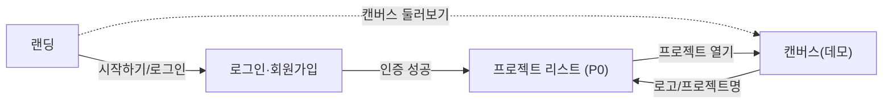

# MarkFlow 화면 설계서 (Screen Design Specification)

| 항목 | 내용 |
| --- | --- |
| 문서 유형 | 화면 설계서 — Claude Design 시안 + PRD v1.2 / 기획서 v1.1 통합 |
| 프로젝트 | MarkFlow — 마크다운 노드 기반 실시간 협업 캔버스 |
| 버전 / 상태 | v1.0 / Draft (디자인 시안 반영) |
| 디자인 출처 | Claude Design 프로젝트 "마크플로우" (`Markflow.dc.html`) |
| 작성일 | 2026-06-23 |

> 한 줄 정의 — FigJam식 무한 캔버스 위에서 마크다운(.md) 노드를 작성·연결하고, 멀티커서·채팅으로 실시간 협업하는 도구. 본 문서는 확정된 디자인 시안을 기준으로 각 화면의 레이아웃·컴포넌트·상태·인터랙션을 정의한다.

---

## 0. 개요 & 읽는 법

- 본 문서는 **Claude Design 시안(`Markflow.dc.html`)에 실제로 구현된 화면**을 기준으로 작성되었으며, 각 화면을 PRD/기획서 요구사항과 매핑한다.
- 우선순위 표기: **P0** = MVP 필수, **P1** = 핵심, **P2** = 확장.
- 상태(State) 표기는 시안의 단일 상태머신(`state.screen`)을 따른다.

### 0.1 화면 구조 (PRD 확정)

네비게이션은 **PRD v1.2 IA를 정본**으로 한다. 시안에 있던 워크스페이스(Workspace) 계층은 채택하지 않는다.

| 구분 | 채택안 (PRD v1.2) |
| --- | --- |
| 네비게이션 | 로그인 → **프로젝트 리스트** → 캔버스 |
| 계층 | 2단 (Project = Canvas 1:1) |

> 시안의 워크스페이스 화면 및 관련 UI(헤더 "워크스페이스" 버튼, 캔버스 로고 → 워크스페이스 이동 등)는 본 설계에서 **프로젝트 리스트로 대체**한다.

---

## 1. 디자인 시스템 (Design Tokens)

### 1.1 컬러 팔레트

| 토큰 | 값 | 용도 |
| --- | --- | --- |
| 앱 배경 | `#F6F5F1` | 전역 배경 (웜 오프화이트) |
| 캔버스 배경 | `#F1EFEA` | 캔버스 surface |
| 패널/카드 surface | `#FBFAF7` | 사이드바, 입력 필드, 코드 에디터 |
| 화이트 | `#FFFFFF` | 카드, 모달, 우측 채팅 패널 |
| 잉크(주 텍스트) | `#171614` | 제목, 다크 버튼, 로고 |
| 보조 텍스트 | `#5C5950` | 본문, 라벨 |
| 뮤트 텍스트 | `#A6A299` | 메타, 캡션, placeholder |
| 기본 보더 | `#E4E1D9` | 카드/패널 테두리 |
| 서브 보더 | `#EFEDE6` | 내부 구분선 |
| **브랜드 그린(액센트)** | **`#10A36B`** | 로고 "flow", 주요 액센트, 링크, 접속 표시, 전송 버튼, 선택 하이라이트 |
| 인라인 코드 bg | `#EFEDE6` | 마크다운 인라인 코드 |
| 코드 블록 bg / fg | `#1B1A17` / `#E9E6DD` | 마크다운 `pre` 블록 |
| 에러 텍스트/bg/보더 | `#C4456A` / `#F9E8ED` / `#E9B9C6` | 인증 에러, 삭제 버튼 |
| 엣지 stroke (캔버스) | `#B9B4A7` | 노드 연결선 (점선 + 마칭앤츠 애니메이션) |
| 스크롤바 thumb | `#D8D4C9` (hover `#C4BFB1`) | 스크롤바 |

### 1.2 노드 타입 컬러 시스템

| 타입 | 라벨 | 배경 | 보더 | 텍스트 | 도트 |
| --- | --- | --- | --- | --- | --- |
| `idea` | 아이디어 | `#FBF3DC` | `#E7CC86` | `#8A6A1F` | `#E0A93B` |
| `doc` | 문서 | `#E6EFF9` | `#AEC9E9` | `#2C5C8A` | `#5B8FC4` |
| `task` | 할 일 | `#E4F2E9` | `#A8D6BA` | `#1F6F4B` | `#3DA372` |
| `decision` | 결정 | `#ECE6F9` | `#C6B8E9` | `#5A4A8A` | `#8E78C8` |
| `data` | 데이터 | `#F9E8ED` | `#E9B9C6` | `#8A2C4A` | `#C4708A` |

### 1.3 타이포그래피

| 용도 | 폰트 | 비고 |
| --- | --- | --- |
| 본문/UI | `Pretendard`, `system-ui`, sans-serif | 한국어 최적화 (CDN v1.3.9) |
| 디스플레이/제목/로고 | `Space Grotesk` (400–700) | Hero, 페이지 제목, 워드마크 |
| 모노스페이스 | `JetBrains Mono` (400–500) | ID, 타임스탬프, 코드, 줌 %, 브레드크럼 |

- Hero H1: 64px / 700 / line-height 1.04 / letter-spacing -.03em
- 페이지 제목 H2: 30px / 700

### 1.4 애니메이션 (keyframes)

| 이름 | 효과 | 사용처 |
| --- | --- | --- |
| `mfup` | 14px 슬라이드업 + 페이드 | 진입 요소 |
| `mffade` | 페이드 | 일반 전환 |
| `mfpop` | scale .96→1 + 페이드 | 모달, 플로팅 채팅 |
| `mfdash` | stroke-dashoffset 이동 | 엣지 마칭앤츠 |

### 1.5 로고

- 다크(`#171614`) 라운드 사각형(28px) 내부에 그린 도트(`#10A36B`, 좌상) + 오프화이트 도트(우하) + 45° 회전 셰브론.
- 워드마크: "Mark"(잉크) + "flow"(그린).

---

## 2. 사이트맵 & 네비게이션 플로우

- 단일 상태머신: `state.screen ∈ {landing, auth, projects, canvas}`, `authMode ∈ {login, signup}`.
- **전역 헤더**: 캔버스를 제외한 모든 화면(`notCanvas`)에 노출.
- **채팅 토글 FAB**: **캔버스(및 상세 에디터 전체화면) 우하단에서만** 노출 — 접속 중인 캔버스 전용 (§3.3).
- **상세 에디터(전체화면)**: 캔버스 노드 더블클릭 시 진입 (§4.4.4).

---

## 3. 공용 컴포넌트

### 3.1 전역 헤더 — P0

- 고정 높이 60px, `padding 0 24px`, 하단 보더 `#E4E1D9`, 반투명 배경 `rgba(246,245,241,.86)` + `backdrop-filter: blur(8px)`, `z-index:40`.
- **좌측**: 로고 + "Markflow" 워드마크 (클릭 → `goHome`: 로그인 시 프로젝트, 비로그인 시 랜딩).
- **우측 (로그인 상태)**: "프로젝트" 버튼(→ 프로젝트 리스트) / 사용자 이니셜 아바타(28px 그린) / "로그아웃" 아웃라인 버튼.
  - *(시안의 "워크스페이스" 버튼을 "프로젝트"로 대체)*
- **우측 (비로그인 상태)**: "로그인" 텍스트 버튼 / "시작하기" 다크 버튼(→ 회원가입).
- 캔버스 화면에서는 **숨김**.

| PRD 매핑 | 헤더 네비 + 로그인/로그아웃 상태 표시 (§4.0) |
| --- | --- |

### 3.2 푸터 — P1

- 랜딩 하단에 노출. Markflow 워드마크 + "© 2025 Markflow · mingyu Lim", 배경 `#FBFAF7`, 상단 보더.

### 3.3 캔버스 전용 채팅 토글 (FAB) — P1

> **범위 결정:** 채팅 토글은 **현재 접속 중인 캔버스에서만 작동**한다. 랜딩·프로젝트 리스트 등 캔버스 외 화면에는 채팅 FAB을 노출하지 않는다. (시안의 "캔버스 외 모든 화면 플로팅 채팅"은 채택하지 않음.)

- 캔버스(상세 에디터 전체화면 포함) 우하단 고정(`right:24 bottom:24`, z-index 80).
- 56px 다크 원형 FAB: 닫힘 시 "💬" + 그린 unread 배지 / 열림 시 "✕".
- 팝오버(344×480px, `mfpop`): 헤더 + 접속자 + 메시지 리스트 + 작성창. **해당 캔버스(프로젝트) 단위 채팅방** — 같은 캔버스 접속자끼리만 대화.
- 우측 패널(§4.4.6)의 "팀 채팅" 탭과 **동일한 채팅 상태를 공유**한다(같은 캔버스 룸). 즉 우측 패널 채팅 = 우하단 토글 채팅 = 같은 방.

---

## 4. 화면별 상세 설계

### 4.1 랜딩 페이지 (`isLanding`) — P1

전체 높이 스크롤, 중앙 정렬, max-width 1080px.

| 영역 | 내용 |
| --- | --- |
| Eyebrow 필 | 그린 도트 + "마크다운 · 노드 캔버스 · AI 채팅" |
| Hero H1 | "마크다운으로 그리는 / **생각의 흐름**" ("생각의 흐름" 그린) |
| 서브카피 | "노드를 잇고, 마크다운으로 적고, AI와 대화하며 정리하세요…" |
| CTA | 다크 "무료로 시작하기"(→회원가입) / 아웃라인 "캔버스 둘러보기"(→데모 캔버스) |
| 제품 프리뷰 | 브라우저 크롬 mock + 300px 점격자 캔버스, 샘플 노드 4개(킥오프/요구사항 정리/MVP 채팅 구현/React Flow 채택) + 베지어 연결선 |
| 기능 그리드(3) | ⌘ 무한 노드 캔버스 / ✎ 마크다운 노드 / ✦ AI 채팅 & 히스토리 |
| 푸터 | §3.2 |

- 상태: 비로그인/로그인 무관 접근 가능. PRD 매핑: §4.1 랜딩 페이지.

### 4.2 로그인 / 회원가입 (`isAuth`) — P0

중앙 단일 카드(max-width 380px). `authMode`로 로그인↔회원가입 토글.

| 요소 | 로그인 | 회원가입 |
| --- | --- | --- |
| 제목 | "다시 오신 걸 환영해요" | "Markflow 시작하기" |
| 부제 | "계속하려면 로그인하세요" | "몇 초면 계정을 만들 수 있어요" |
| 필드 | 이메일, 비밀번호 | **이름**, 이메일, 비밀번호 |
| 제출 버튼 | "로그인" | "계정 만들기" |
| 토글 링크 | "아직 계정이 없으신가요? **회원가입**" | "이미 계정이 있으신가요? **로그인**" |

- 입력 필드: 배경 `#FBFAF7`, 보더 `#E4E1D9`, radius 10px. 비밀번호 `type=password`(placeholder "••••••••").
- **검증/에러**: 필수 누락 → "모든 항목을 입력해 주세요.", 이메일 정규식(`.+@.+\..+`) 실패 → "올바른 이메일을 입력해 주세요." (핑크 에러 박스).
- 성공 시 **프로젝트 리스트**로 이동.
- PRD 매핑: §4.2 (JWT 자체 구현, 비밀번호 해시 저장은 백엔드).

### 4.3 프로젝트 리스트 (`isProjects`) — P0

단일 스크롤 컬럼, max-width 980px. **로그인 후 첫 화면.**

- **헤더 행**: H2 "프로젝트" / 다크 "+ 새 프로젝트" 버튼.
  - *(시안의 "‹ 워크스페이스" 백 버튼·워크스페이스명 헤더는 제거)*
- **프로젝트 그리드**(`minmax(240px,1fr)`):
  - 118px 썸네일: 점격자 + 미니 노드 3개(yellow/blue/green) + 베지어 연결선 2개. 클릭 → 캔버스 진입.
  - 본문: **인라인 편집 가능한 프로젝트명 input**(소유자만 rename 반영) / "✕" 삭제 버튼 / 메타 "(내 프로젝트|공유됨) · 노드 N · {수정시각}".
- **시드**: 제품 로드맵(5), 리서치 노트(8), 블로그 초안(공유, 3), 스프린트 보드(12), 아이디어 덤프(4).
- PRD 매핑: §4.3 — 목록 표시, 생성 시 캔버스 동반 생성, 소유자만 이름 변경/삭제, 선택 시 캔버스 진입. (권한 가드는 서버에서, 프론트 비활성화는 UX용.)

### 4.4 캔버스 (`isCanvas`) — 핵심 화면

전체 화면 점격자 캔버스(`#F1EFEA`, 24px 점격자). **헤더 숨김.** 좌측 사이드바 + 중앙 캔버스 + 우측 패널 + 하단 컨트롤로 구성. 각 패널은 접힘/펼침 2상태.

#### 4.4.1 좌측 노드 리스트 사이드바 — P0

- **펼침(256px, 기본)**: 다크 로고(→프로젝트 리스트) / 프로젝트 블록(→프로젝트 리스트, 프로젝트명 + "노드 N개") / "+" 추가 + "«" 접기. 본문: "노드 리스트" 라벨 + 노드 목록(컬러 도트 + 제목 + 모노 id, 선택 행 tint). 하단 힌트: "드래그로 노드를 옮기고, 더블클릭으로 편집, 휴지통으로 끌어다 놓으면 삭제됩니다."
- **접힘(52px 레일)**: 로고/홈 / "»" 펼치기 / "+" 노드 추가 / 미니 노드 리스트(상위 12개, 11px 컬러 도트) / 하단 노드 카운트.

#### 4.4.2 중앙 캔버스 (React Flow) — P0

- 팬: `onCanvasDown`으로 시작(빈 곳 클릭 시 선택 해제). transform = `translate(panX,panY) scale(scale)`. 기본 `scale 0.74, pan 24/34`.
- **엣지**: SVG 베지어, stroke `#B9B4A7` width 2, `dasharray 6 6` + `mfdash` 마칭앤츠. 소스 우측 앵커(x+186, y+44) → 타깃 좌측 앵커.
- **노드**: 186px 라운드 카드. `mousedown`=드래그+선택, `dblclick`=상세 에디터(전체화면). 표시: 타입 도트 + 대문자 타입 라벨 + 볼드 제목 + **접기/펼치기 토글 버튼**.
  - **접힘(collapsed, 기본)**: 제목 + 모노 프리뷰 한 줄(첫 비제목 라인 26자 truncate). 토글 버튼 "▸/펼치기".
  - **펼침(expanded)**: 카드 내부에 마크다운 렌더 본문(요약 이상) 표시. 토글 버튼 "▾/접기".
  - 토글은 카드 우상단 버튼으로 노출하며 `Node.collapsed` 필드와 양방향 바인딩. (드래그·선택과 충돌하지 않도록 `stopPropagation`.)
- 선택 시 그린 포커스 링(`0 0 0 3px {dot}55`).
- **시드 흐름**: 킥오프(idea)→요구사항 정리(doc), 킥오프→MVP 채팅 구현(task), 요구사항 정리→React Flow 채택?(decision), MVP 채팅 구현→노드 스키마(data).
- PRD 매핑: §4.4.1 — 생성·이동·삭제, 엣지 연결+화살표, 팬/줌/미니맵/fitView, `{nodes,edges}` JSON 직렬화 저장(2초 debounce + 수동).

#### 4.4.3 줌 컨트롤 — P0

- 하단 우측 정렬 화이트 필. 우측 패널 상태(`ctrlRight`: 372/84px)에 따라 위치 이동.
- 모노 줌 % 라벨 / "+"(max 2) / "−"(min 0.4) / "⊙" 리셋(화면 맞춤, 0.74/24/34 복원).

#### 4.4.4 MD 노드 상세 에디터 — 전체화면 (`detailOpen`) — P0

- 노드 더블클릭 시 진입. **캔버스 위를 가득 채우는 전체화면 에디터**(시안의 880px 모달이 아닌 풀스크린). z-index 90.
- **헤더**: 타입 도트 + **인라인 편집 제목 input**(노드 라이브 업데이트) + 모노 타입 라벨(타입 색 tint 배경) + 닫기 "✕"(→ 캔버스로 복귀).
- **2-pane 바디(전체 높이)**:
  - 좌: "MARKDOWN" 라벨 + 모노스페이스 textarea(`#FBFAF7`, JetBrains Mono 13px) — 편집 시 노드 라이브 업데이트.
  - 우: "미리보기" 라벨 + 렌더 HTML(h1–h3, 리스트, 인용, 코드펜스, 인라인 코드/볼드/이탤릭, 체크박스 `[ ]`→☐ / `[x]`→☑).
- **푸터**: 핑크 아웃라인 "노드 삭제" / 다크 "완료".
- **우하단 채팅 토글(§3.3)**: 전체화면 에디터에서도 우하단 채팅 FAB이 유지되어, **같은 캔버스의 채팅방**을 작은 팝오버로 열 수 있다.
- PRD 매핑: §4.4.2 — .md 작성, 마크다운 에디터 상세 편집·렌더. (요약↔상세 전환은 캔버스 노드 카드의 접기/펼치기 토글 §4.4.2에서 담당.)

#### 4.4.5 휴지통 (아코디언 + 드래그 드롭존) — P1

- 하단 좌측(`#mf-trash`). 좌측 패널 상태(`ctrlLeft`: 288/84px)에 따라 위치 이동.
- **드롭 힌트**: 그린 배너 "놓으면 휴지통으로 이동됩니다", 호버 시 버튼 scale 1.05 + 그린 배경.
- **아코디언 패널**: 헤더 "임시 저장소 · {count}" / 빈 상태 "비어 있습니다" / 항목 리스트(컬러 도트 + 제목 + "복원" 버튼).
- **토글 버튼**: 🗑 "휴지통" + 모노 카운트.
- **드래그 삭제 로직**: 포인터가 휴지통 영역 위에서 mouseup → 노드+연결 엣지 제거, 휴지통으로 이동, 자동 펼침, 히스토리 기록("'{title}' 노드를 휴지통으로 보냈습니다").
- PRD 매핑: §4.4.5 — 소프트 삭제(deletedAt), 아코디언 리스트, 복구(deletedAt→null). **임시 저장소 + 휴지통 통합** 결정 반영.

#### 4.4.6 우측 팀 채팅 / 히스토리 패널 — P1

- **펼침(340px 화이트, 기본)**: 탭바("»" 접기 / "팀 채팅" / "히스토리", 활성 탭 그린 언더라인).
  - **팀 채팅 탭**: 접속자 헤더(겹친 아바타 + 그린 도트 + "N명 접속 중") / 메시지 리스트(본인 우측 그린 버블, 타인 좌측 `#F1EFEA` 버블 + 이름·아바타·시각) / 입력 인디케이터("{name} 님이 입력 중…") / 작성창(textarea "메시지 보내기…", Enter 전송 / Shift+Enter 줄바꿈, 그린 원형 "↑").
  - **히스토리 탭**: 세로 타임라인(컬러 도트 + 연결선 + 이벤트 텍스트 + 모노 시각). 생성/삭제/복원 시 prepend.
- **접힘(52px 레일)**: "«" 펼치기 / "💬" 채팅(그린 unread 도트) / 접속자 아바타 세로 스택.
- PRD 매핑: §4.4.3 채팅(프로젝트 단위, 저장·재접속 유지), §4.4.4 Node 히스토리(변경 로그, 시간순 열람), §5 실시간 협업(접속자 프레즌스).

---

## 5. 실시간 협업 매핑 (PRD §5) — Socket.io 직접 구현 (정본)

> **구현 결정:** 멀티커서·소프트 락·프레즌스·노드 동기화·채팅 등 실시간 협업은 **Socket.io 직접 구현**한다(정본). 프론트는 `useCollaboration`(CollabAPI) 추상화 뒤에 두어, 막힐 경우 동일 인터페이스로 Liveblocks(차선)로 교체한다. 시안은 프레즌스·채팅만 표현되어 있으므로, 멀티커서·소프트락 UI는 아래 명세대로 캔버스 오버레이에 추가한다. (이벤트 규격 → `09-API-Spec.md §7`)

| PRD §5 요구사항 | 시안 반영 | Socket.io 구현 |
| --- | --- | --- |
| 멀티커서 실시간 표시 (P1) | ✗ (미표현) | `cursor:move` broadcast로 타인 커서 렌더(이름표 + 컬러). 캔버스 오버레이, ≈50ms throttle |
| 노드 추가/수정/이동/삭제 동기화 (P1) | △ (로컬만) | `node:*`·`edge:*` 이벤트 broadcast, last-write-wins |
| 소프트 락 "OO 편집 중" (P1) | ✗ (시안 락 없음) | `lock:acquire/release` → `lock:update` broadcast → "OO 편집 중" 배지 + 카드 잠금 |
| 초기 싱크 / 끊김 재동기화 (P0/P1) | ✗ | 룸 입장 시 `sync:init`, 재접속 시 `sync:resync` |
| 접속자 프레즌스 | ✓ | `presence:update` → "N명 접속 중" 라벨 + 아바타 스택 |
| 캔버스 채팅 (§3.3) | ✓ | 캔버스(=Socket.io Room `project:<id>`) 단위 메시지. 우측 패널 탭과 우하단 토글이 같은 방 공유 |

- **Room = 캔버스 1개** (`project:<projectId>`). 프로젝트 = 캔버스 1:1이므로 프로젝트 단위 룸과 동일. 채팅·캔버스는 분리하지 않고 같은 룸에서 이벤트 이름으로 구분.
- **소프트 락 UI 명세**: 노드가 타인에 의해 편집 중이면 카드에 잠금 아이콘 + "OO 편집 중" 배지 표시, 본인은 진입 차단(읽기 전용 미리보기). 편집 종료 시 해제.
- **멀티커서 UI 명세**: 타인 커서를 컬러 포인터 + 이름표로 캔버스 좌표계에 오버레이. 사용자별 고정 색상.

---

## 6. 권한별 화면 동작 (PRD §6)

| 동작 / 화면 요소 | 뷰어 | 에디터 | 소유자 |
| --- | --- | --- | --- |
| 캔버스·채팅 열람 | O | O | O |
| 노드 추가("+")·이동·상세 편집 | 비활성 | O | O |
| 노드 휴지통 이동·복원 | 비활성 | O | O |
| 채팅 작성창 | 비활성 | O | O |
| 프로젝트명 인라인 편집·삭제("✕") | 숨김 | 숨김 | O |
| 멤버 초대·권한 지정 | 숨김 | 숨김 | O |

- 프론트 비활성화는 UX용. **진짜 가드는 REST + Socket 양쪽 서버에서 수행** (PRD §6).
- 비소유자 프로젝트는 "공유됨" 메타 표시 + rename input 무시.

---

## 7. 화면 ↔ 데이터 엔티티 매핑 (PRD §8)

| 화면 | 주요 엔티티 |
| --- | --- |
| 로그인/회원가입 | User (email, passwordHash, name) |
| 프로젝트 리스트 | Project, ProjectMember(role) |
| 캔버스 노드 | Node (title, markdown, type, collapsed, posX/posY, deletedAt) |
| 엣지 연결 | Edge (sourceId, targetId) |
| 팀 채팅 | ChatMessage (projectId, userId, content) |
| 히스토리 탭 | ActivityLog (projectId, userId, targetType, targetId, action) |
| 휴지통 | Node/Project의 deletedAt |

---

## 8. 미해결 항목 / 후속 결정

1. **반응형/모바일** — 데스크톱 Chrome 기준(PRD §7). 모바일은 범위 밖.

### 8.1 결정 완료 사항

| 항목 | 결정 |
| --- | --- |
| 화면 계층 | 워크스페이스 미채택. 프로젝트 = 캔버스 1:1, 로그인 후 첫 화면 = 프로젝트 리스트 |
| 실시간 협업(멀티커서·소프트락·프레즌스) | **Socket.io 직접 구현** 채택 (§5). Liveblocks는 CollabAPI 뒤 차선책 |
| 노드 접기/펼치기 | 캔버스 노드 카드의 **토글(접기/펼치기) 버튼**으로 처리 (§4.4.2) |
| 노드 상세 편집 | 더블클릭 → **전체화면 에디터** (§4.4.4) |
| 채팅 | **캔버스 전용** — 접속 중인 캔버스에서만 작동, 우하단 토글 + 우측 패널 탭이 같은 방 공유 (§3.3) |
| AI 기능 | **보류** (이번 범위 제외) |

---

## 관련 문서

- PRD (제품 요구사항 정의서) — `02-PRD.md`
- 기획서 — `01-Proposal.md`
- 데이터 모델(ERD) / API 명세서 / 기술 설명서(Tech Spec)
- 디자인 시안 — Claude Design "마크플로우" (`Markflow.dc.html`)
