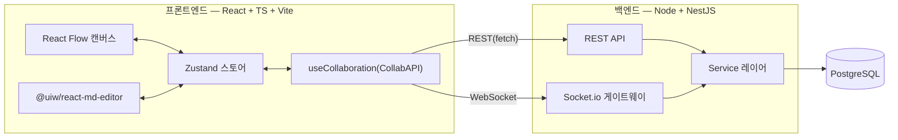

# MarkFlow 기술 설명서 (Tech Spec)

| 항목 | 내용 |
| --- | --- |
| 문서 유형 | 기술 설명서 (Technical Specification) |
| 프로젝트 | MarkFlow — 마크다운 노드 기반 실시간 협업 캔버스 |
| 버전 / 상태 | v1.0 / Draft (PRD v1.3 · 기획서 v1.2 · ERD v1.1 · API v1.1 정합) |
| 팀 / 기간 | 3인 / 4주 |
| 작성일 | 2026-06-24 |

> 본 문서는 MarkFlow의 **기술 구현 기준**을 정의한다. 화면·기능은 PRD/기능정의서, 데이터는 ERD, API 규격은 API 명세서, 백엔드 내부 구조는 ARCHITECTURE를 정본으로 하며, 본 문서는 이들을 **한 장으로 묶는 상위 기술 개요**다.

---

## 0. 핵심 기술 결정 (정합성 기준선)

| # | 결정 | 근거 |
| --- | --- | --- |
| 1 | **실시간 = Socket.io 직접 구현(정본)** | PROPOSAL 1순위. CollabAPI 추상화 뒤에 두어 막힐 시 Liveblocks(차선) 교체 가능 |
| 2 | **캔버스 저장 = Node/Edge 정규화** | 노드 단위 실시간 동기화·소프트락·휴지통·활동 로그. JSONB 통째 저장 폐기 |
| 3 | **변경 이력 = ActivityLog(폴리모픽)** | 노드·엣지·프로젝트 이벤트를 한 타임라인에. 내용 복원/diff 없음 |
| 4 | **인증 = JWT 자체 구현, 액세스 토큰만** | stateless. RefreshToken 미채택(향후 확장) |
| 5 | **휴지통 = 소프트 삭제 + 영구 삭제** | deletedAt 통합 휴지통 + 물리 삭제(복구 불가) |
| 6 | **백엔드 = 레이어드(서비스) 아키텍처** | 풀 클린 아키텍처 미채택. 로직≠전송, 서비스 seam |
| 7 | **권한 = REST + Socket 양쪽 서버 가드** | OWNER/EDITOR/VIEWER 3단계, 프론트는 UX용 |

---

## 1. 시스템 구성



- **단일 페이지 앱(SPA)** + REST + WebSocket. NestJS(+`@nestjs/platform-socket.io`)로 같은 서버(포트)에서 REST와 Socket.io를 함께 서빙.
- 프론트 상태 단일 진실원 = **Zustand**. React Flow·MD 에디터·실시간 수신이 모두 store를 통함.
- 실시간 구현체는 **`useCollaboration`(CollabAPI)** 뒤에 은닉 → Socket.io↔Liveblocks 교체 가능.

---

## 2. 기술 스택

| 레이어 | 기술 | 비고 |
| --- | --- | --- |
| 프론트 | React + TypeScript + Vite | SPA 베이스 |
| 캔버스 | React Flow (@xyflow/react) | 노드·엣지·팬/줌/미니맵/fitView |
| 마크다운 | @uiw/react-md-editor | 노드 .md 작성/렌더 |
| 상태 | Zustand | nodes/edges/presence/messages |
| 스타일 | Tailwind CSS | 디자인 토큰(화면설계서 §1) |
| 백엔드 | Node.js + NestJS | REST API (`@nestjs/platform-socket.io`로 WS 동일 서버) |
| 실시간 | **Socket.io (정본)** / Liveblocks (차선) | 룸·동기화·커서·락·채팅 |
| DB | PostgreSQL + Prisma | Node/Edge 정규화 |
| 인증 | JWT (이메일/비밀번호) | 액세스 토큰만 |
| 검증 | Zod | REST body·소켓 payload 공용 DTO |

---

## 3. 백엔드 아키텍처 (요약)

상세 → `06-Backend-Architecture.md`. 핵심만:

```
Controller / Gateway   →   Service   →   Prisma
   (전송만)            (로직+권한+로그+트랜잭션)   (DB)
```

- **서비스 seam**: REST 컨트롤러와 Socket 핸들러가 **같은 서비스 함수**(`nodeService.create()` 등)를 호출 → 로직·권한·ActivityLog 중복/누락 방지.
- **트랜잭션 경계 = 서비스 메서드**: 변경 + ActivityLog 기록을 한 `$transaction`으로. (예: 노드 휴지통 = soft-delete + 엣지 물리삭제 + 로그)
- **Repository 레이어 없음**: Prisma가 데이터 접근 계층. 4주 범위에서 추상화 생략.

폴더(요약): `modules/{auth,projects,members,nodes,edges,chat,activity}` · `realtime/{socket,canvas.gateway,chat.gateway,presence}` · `shared/{permission,dto}` · `prisma/`.

---

## 4. 데이터 모델 (요약)

상세 → `08-ERD.md` / `08-ERD.dbml`. 7개 엔티티:

| 엔티티 | 역할 | 소프트삭제 |
| --- | --- | --- |
| User | 사용자(JWT) | — |
| Project | 프로젝트(=캔버스 1:1) | deletedAt |
| ProjectMember | 역할(OWNER/EDITOR/VIEWER), 역할 단일소스 | — |
| Node | 마크다운 노드(type/collapsed/posX·posY) | deletedAt |
| Edge | 노드 연결(중복·자기연결 금지) | — (물리삭제) |
| ChatMessage | 프로젝트 단위 채팅 | — |
| ActivityLog | 활동 로그(targetType: NODE/EDGE/PROJECT) | — |

- **정규화 저장**: 프론트의 `{ nodes, edges }`는 정규화 row를 조합한 응답 형태. 저장은 row 단위.
- **OWNER 1명 보장**: `UNIQUE(projectId) WHERE role='OWNER'` 부분 유니크(raw SQL).
- **ActivityLog.targetId**: 폴리모픽(FK 아님), 불변 로그. 영구삭제돼도 댕글링 유지 + 표시 라벨 폴백.

---

## 5. API 개요

상세 → `09-API-Spec.md`.

- Base `/api`, `application/json`, `Authorization: Bearer <accessToken>`.
- 표준 에러: `{ error: { code, message, details } }`. 코드: 400/401/403/404/409/422/500.
- 주요 그룹: `/auth/*`, `/projects/*`(+trash/permanent), `/projects/:id/{canvas,nodes,edges,messages,history,members}`.
- 페이지네이션: 채팅·히스토리는 커서 기반(`?limit&before`, `nextCursor`).

---

## 6. 실시간 설계 (Socket.io)

상세 → `06-Backend-Architecture.md §4`. 핵심 규약:

- **연결 1개 · 룸 1개**: `room = project:<projectId>`. 채팅·캔버스 분리하지 않고 **이벤트 이름으로 구분**(네임스페이스 분리 ✗).
- **인증 핸드셰이크**: 연결 시 JWT 검증 + 룸 입장 시 `ProjectMember.role` 확인. 변경 이벤트마다 서비스 진입부에서 재검사.

| prefix | 이벤트 | 영속화 |
| --- | --- | --- |
| `sync:` | `sync:init`(초기 상태), `sync:resync`(재접속) | 조회 |
| `cursor:` | `cursor:move` (≈50ms throttle) | in-memory |
| `node:` | `node:add/update/move/delete` | nodeService |
| `edge:` | `edge:add/delete` | edgeService |
| `lock:` | `lock:acquire/release` ("OO 편집 중") | in-memory(presence) |
| `chat:` | `chat:message`, `chat:typing` | chatService |

- **동시성**: 노드 단위 last-write-wins + 소프트 락(한 노드 한 명 편집)으로 CRDT 회피.
- **잔버그 3종**: ① 초기 싱크 ② 끊김 재접속 ③ 이벤트 순서 — `sync:init` 1순위.
- **프론트 처리**: 원격 수신은 store에 적용만(재emit 금지), 내 액션만 emit → 에코 루프 방지. (`07-Frontend-Architecture.md §4` 참조)

### 6.1 CollabAPI 추상화 매핑

컴포넌트는 `useCollaboration()`만 바라본다. 내부 구현체(Socket.io 정본 / Liveblocks 차선)를 교체해도 UI 코드는 불변.

| 인터페이스 | 1순위 (Socket.io) | 차선 (Liveblocks) | 역할 |
| --- | --- | --- | --- |
| `useCollaboration()` | `useSocketCollab` | `useLiveblocksCollab` | 컴포넌트가 바라보는 단일 훅 |
| `emitNodeChange()` | `socket.emit('node:*')` | Liveblocks mutation | 노드 add/update/move/delete 송신 |
| `onNodeChange()` | `socket.on('node:*')` | `useStorage` 구독 | 외부 변경 수신 → Zustand 갱신(LWW) |
| presence(커서) | `cursor:move` broadcast | `useOthers()` | 멀티커서 좌표+이름, ≈50ms throttle |
| `lock()/unlock()` | `lock:*` 이벤트 | Liveblocks storage | 소프트 락("OO 편집 중"), CRDT 대체 |
| init(초기 싱크) | `sync:init`(DB→클라) | RoomProvider 자동 | 접속/재접속 시 현재 상태 수신 |

---

## 7. 인증 · 보안

- 비밀번호 **bcrypt/argon2 해시** 저장. 응답에 `passwordHash` 절대 미포함.
- JWT payload `{ sub, email, iat, exp }`, 액세스 토큰만(만료 넉넉히). 만료 시 `401` → 재로그인.
- **권한은 서버가 최종 가드**: REST(미들웨어+서비스) + Socket(핸드셰이크+이벤트). 뷰어 변경은 `403`/거부. 프론트 비활성화는 UX용.
- 입력 검증 Zod(이메일 정규식, 길이 등). CORS 화이트리스트. 환경변수는 `config/env.ts`에서 검증 후 주입.

### 7.1 권한 검사 위치

| 위치 | 방법 | 검사 항목 | 비고 |
| --- | --- | --- | --- |
| REST(서버) | JWT 미들웨어 + 서비스 진입부 | ① 토큰 유효성 ② 멤버 여부 ③ 역할(OWNER/EDITOR/VIEWER) | 실제 보안 가드 |
| Socket(서버) | 핸드셰이크 + 이벤트 핸들러 | ① handshake JWT ② 룸 참여 권한 ③ 이벤트별 역할 | REST와 동일 `assertPermission` 재사용(우회 방지) |
| 프론트(클라) | 조건부 렌더링 | OWNER 전용 버튼 비활성·소프트락 UI | UX 목적만 — 서버 미적용 시 우회 가능 |

| 역할 | 허용 범위 |
| --- | --- |
| OWNER | 프로젝트 삭제·이름변경·영구삭제·멤버관리 포함 전체 |
| EDITOR | 캔버스 접근·노드/엣지 변경·채팅 |
| VIEWER | 읽기 전용(캔버스·채팅 열람만, 변경 이벤트 거부) |

---

## 8. 비기능 요구사항

| 분류 | 기준 |
| --- | --- |
| 성능 | 커서 ≈50ms throttle, 저장 ≈2초 debounce, 변경 반영 ≈1초 이내 |
| 동시성 | 노드 단위 last-write-wins + 소프트 락 |
| 안정성 | 끊김 재접속 시 상태 재동기화(`sync:resync`), 초기 싱크 보장 |
| 보안 | 비밀번호 해시, JWT 검증, 서버 권한 가드 |
| 호환성 | 데스크톱 최신 Chrome 기준 |

---

## 9. 개발 · 배포

- **모노레포(권장)**: `apps/web`(Vite) + `apps/api`(NestJS) 또는 단순 2-폴더. 타입(노드 DTO)·검증(Zod) 공유.
- **DB 마이그레이션**: Prisma Migrate. 스키마 정본 = `08-ERD.md`/`08-ERD.dbml`. 부분 유니크·CHECK는 raw SQL 마이그레이션 보강.
- **환경변수**: `DATABASE_URL`, `JWT_SECRET`, `JWT_EXPIRES_IN`, `PORT`, `CORS_ORIGIN`.
- **실행**: `main.ts`에서 NestFactory로 부트스트랩(`enableCors` + `listen`). Socket.io는 `@nestjs/platform-socket.io` 기본 IoAdapter로 같은 HTTP 서버에 attach.

---

## 10. 역할 분담 (기술 관점)

| 담당 | 영역 | 주요 산출 |
| --- | --- | --- |
| **BE** | 백엔드 전체 | `prisma/`·`modules/*`·`shared/*`·`realtime/*` — Prisma·REST·서비스·권한 + Socket.io 게이트웨이·프레즌스·락·동기화 (소켓+도메인 통합) |
| **FE-F1** | 캔버스/실시간 | React Flow, 노드 카드, `useCollaboration`, 멀티커서·락 UI, Zustand |
| **FE-F2** | 셸/콘텐츠/패널 | 인증·프로젝트리스트, MD 상세 에디터, 채팅·히스토리·휴지통 UI, API 클라이언트 |

> Day 1 계약: ① Prisma 스키마 ② `assertPermission` ③ 서비스 시그니처 ④ DTO·CollabAPI 인터페이스. 이 4개가 BE↔FE 분배의 접합면이다. **BE가 단독 크리티컬 패스**이므로 1주차에 계약을 최우선 제공한다.

---

## 11. 리스크 & 대응

| # | 리스크 | 상황 | 대응 | 담당 | 우선순위 |
| --- | --- | --- | --- | --- | --- |
| 1 | 실시간 디버깅 지연 | 잔버그 3종(초기싱크·재접속·이벤트순서) | CollabAPI 추상화로 Liveblocks 차선책 병렬 준비, 3주차 고정 | BE / FE-F1 | 높음 |
| 2 | 동시 텍스트 편집 충돌 | 한 노드 동시 편집 시 손실 | 소프트 락(한 노드 한 명) → 충돌 구조적 회피(CRDT 미사용) | BE / FE-F1 | 높음 |
| 3 | 권한 우회 | 프론트만 비활성화 시 API 직접 호출 | REST+Socket 양쪽 서버 가드 의무화(`assertPermission`) | BE | 중간 |
| 4 | 캔버스 성능 저하 | 노드 수 증가 시 React Flow 렌더 | 노드 가상화 활용, 필요 시 노드 수 가이드 | FE-F1 | 중간 |
| 5 | 영구삭제 사고 | 복구 불가 데이터 손실 | 확인 모달 필수 + 소유자/에디터 권한 제한 | FE-F2 / BE | 중간 |
| 6 | **BE 단독 병목** | 백엔드 1명이 소켓+도메인 전담 | 1주차 계약 최우선·P2 후순위·3주차 F1 페어, 막히면 Liveblocks | BE / 전체 | 높음 |

---

## 12. 개발 일정 (4주)

| 주차 | 목표 | 주요 작업 | 담당 |
| --- | --- | --- | --- |
| 1주 | 인증 + 프로젝트 + 캔버스 기본 | JWT 회원가입/로그인, NestJS 모듈/컨트롤러 REST 구조, Prisma 모델링, React Flow 노드·연결 | BE·FE-F1·F2 |
| 2주 | MD 노드 + 저장 + 휴지통 | @uiw/react-md-editor, 접기/펼치기, **Node/Edge 정규화 저장 + debounce**, 소프트삭제·복구·영구삭제 | BE·FE-F1·F2 |
| 3주 | 실시간 협업(하이라이트) | Socket.io 룸·`sync:init`, 멀티커서(50ms), 노드 동기화(LWW), 소프트락, 채팅 (막히면 Liveblocks) | BE·FE-F1 |
| 4주 | 활동로그 + 통합 + 발표 | 히스토리 타임라인, 통합 테스트·버그(잔버그 3종), 데모 (여유 시 export) | 전체 |

> 진행 원칙 — ① 캔버스+노드(정체성) → ② 저장+휴지통(안정 CRUD) → ③ 실시간(하이라이트). Day 1에 BE가 Prisma 스키마+서비스 스텁을 먼저 내주면 FE/소켓이 막히지 않음.

---

## 13. 범위 밖 (Out of Scope)

CRDT 글자 단위 동시편집 · AI(노드 초안/챗봇, 보류) · 모바일/오프라인 · 외부 공개 공유 링크 · 히스토리 내용 복원/diff · RefreshToken · 이메일 본인인증/비밀번호 찾기 · GitHub export(여유 시 P2).

---

## 관련 문서

- PRD — `02-PRD.md` / 기획서 — `01-Proposal.md` / 기능정의서 — `03-Feature-Spec.md`
- 화면 설계서 — `04-Screen-Design.md`
- 데이터 모델 — `08-ERD.md` / `08-ERD.dbml`
- API 명세서 — `09-API-Spec.md`
- 백엔드 아키텍처 — `06-Backend-Architecture.md`
