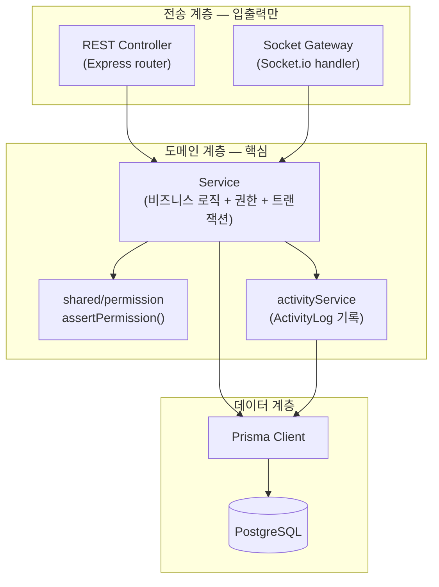

# MarkFlow 백엔드 아키텍처 (Backend Architecture)

| 항목 | 내용 |
| --- | --- |
| 문서 유형 | 백엔드 아키텍처 설계 |
| 프로젝트 | MarkFlow — 마크다운 노드 기반 실시간 협업 캔버스 |
| 버전 / 상태 | v1.0 / Draft |
| 작성일 | 2026-06-24 |
| 스택 | Node.js + Express + Socket.io + Prisma + PostgreSQL + TypeScript |

> 한 줄 정의 — **레이어드(서비스) 아키텍처**. 비즈니스 로직을 전송 계층(REST/Socket)에서 분리해, REST 컨트롤러와 Socket 핸들러가 **같은 서비스 함수**를 호출한다. 풀 클린 아키텍처의 격식(Entity/UseCase/Repository 인터페이스/DI)은 4주 MVP 범위에서 채택하지 않는다.

---

## 0. 설계 원칙

1. **로직 ≠ 전송** — 비즈니스 로직·권한·로그는 **Service**에만. Controller/Gateway는 입력 파싱·서비스 호출·응답 포맷만.
2. **단일 진실원(seam)** — 같은 mutation(노드 생성 등)은 REST든 Socket이든 **하나의 서비스 함수**로 수렴. 코드·정합성·ActivityLog 중복 방지.
3. **서버가 진짜 가드** — 권한은 REST·Socket 양쪽 서버에서 검사(PRD §6). 프론트 비활성화는 UX용.
4. **얇게 유지** — Repository 인터페이스 추상화 없음(Prisma가 곧 데이터 접근 계층). 격식보다 데모 동작 우선.
5. **트랜잭션 경계 = 서비스 메서드** — 변경 + ActivityLog 기록은 한 트랜잭션.

---

## 1. 레이어 구조



| 계층 | 책임 | 금지 |
| --- | --- | --- |
| **Controller / Gateway** | HTTP/WS 입출력, DTO 검증, 서비스 호출, 응답·브로드캐스트 | Prisma 직접 호출 ✗, 권한 if문 ✗, 비즈니스 로직 ✗ |
| **Service** | 비즈니스 로직, 권한 검사, 트랜잭션, ActivityLog | HTTP/WS 객체(req/res/socket) 의존 ✗ |
| **Prisma** | DB 접근 | — |

---

## 2. 폴더 구조

```
src/
  lib/
    prisma.ts            # PrismaClient 싱글턴
    jwt.ts               # sign/verify
    errors.ts            # AppError(code,status) + 에러 매핑
  config/
    env.ts               # 환경변수 로드·검증(zod)
  middleware/
    auth.ts              # JWT 검증 → req.user
    error-handler.ts     # AppError → 표준 에러 응답(09-API-Spec.md §0.3)
  shared/
    permission.ts        # assertPermission(projectId, userId, minRole)  ← REST·Socket 공용
    dto/                 # zod 스키마(요청 검증, 양쪽 재사용)
  modules/
    auth/        auth.controller.ts   auth.service.ts
    projects/    project.controller.ts project.service.ts
    members/     member.controller.ts member.service.ts
    nodes/       node.controller.ts   node.service.ts      # ← 공유 seam
    edges/       edge.controller.ts   edge.service.ts      # ← 공유 seam
    chat/        chat.controller.ts   chat.service.ts      # ← 공유 seam
    activity/    activity.controller.ts activity.service.ts
  realtime/
    socket.ts            # io 부트스트랩 + 인증 핸드셰이크
    canvas.gateway.ts    # node:/edge:/cursor:/lock: 이벤트 → service 호출
    chat.gateway.ts      # chat: 이벤트 → chatService 호출
    presence.ts          # 커서·소프트락(in-memory, DB 불필요)
    rooms.ts             # roomOf(projectId) = `project:<id>`
  app.ts                 # express 앱(라우터·미들웨어 조립)
  server.ts              # http 서버 + socket 부트스트랩
prisma/
  schema.prisma          # 08-ERD.md/08-ERD.dbml 기준
  migrations/
```

**소유권**: `modules/*` · `shared/` · `prisma/` = **B2(REST/도메인)** / `realtime/*` = **B1(소켓)**. B1은 service를 **호출만** 한다.

---

## 3. 핵심 패턴: 서비스 seam

같은 로직을 REST와 Socket이 따로 구현하면 ActivityLog 누락·정합성 붕괴가 생긴다. **service 1곳**으로 수렴시킨다.

```ts
// modules/nodes/node.service.ts  — 전송 수단에 무관(seam)
export const nodeService = {
  async create(input: CreateNodeInput, actor: Actor) {
    await assertPermission(input.projectId, actor.userId, 'EDITOR');     // 권한도 여기
    return prisma.$transaction(async (tx) => {                            // 변경 + 로그 = 1 트랜잭션
      const node = await tx.node.create({ data: input });
      await activityService.record(tx, {
        projectId: input.projectId, userId: actor.userId,
        targetType: 'NODE', targetId: node.id, action: 'CREATE',
      });
      return node;
    });
  },
  // update(MOVE/UPDATE 판별) / softDelete(+엣지 물리삭제) / restore / purge ...
};
```

```ts
// REST (B2) — modules/nodes/node.controller.ts
router.post('/projects/:projectId/nodes', auth, async (req, res, next) => {
  try {
    const node = await nodeService.create(parseCreateNode(req), actorOf(req));
    res.status(201).json(node);
  } catch (e) { next(e); }
});
```

```ts
// Socket (B1) — realtime/canvas.gateway.ts
socket.on('node:add', async (payload, ack) => {
  const node = await nodeService.create(payload, actorOf(socket));   // ← 같은 함수
  socket.to(roomOf(payload.projectId)).emit('node:added', node);     // 타인에게 broadcast
  ack?.({ ok: true, node });
});
```

> 결과: 노드가 REST로 들어오든 소켓으로 들어오든 **권한 검사·DB 반영·ActivityLog가 동일**하게 처리된다.

---

## 4. 실시간(Socket.io) 설계

> 전제: **Socket.io 직접 구현**(정본). 막힐 시 동일 CollabAPI 뒤에서 Liveblocks(차선)로 교체 — 이벤트 규격은 `09-API-Spec.md §7` 참조.

- **연결 1개 · 룸 1개**: `room = project:<projectId>`. 채팅·캔버스를 **분리하지 않고** 같은 룸에서 이벤트 이름으로 구분(화면설계서 §3.3 "채팅=캔버스 룸").
- **네임스페이스 분리 안 함**: 기본 네임스페이스 + room으로 충분.
- **핸들러 파일만 분리**: `canvas.gateway.ts` / `chat.gateway.ts`가 같은 socket에 등록.

```ts
// realtime/socket.ts
io.use(authHandshake);                      // JWT 1회 검증 → socket.data.user
io.on('connection', (socket) => {
  registerCanvasGateway(socket, io);
  registerChatGateway(socket, io);
});
```

| prefix | 이벤트 | 영속화 |
| --- | --- | --- |
| `sync:` | `sync:init`(접속 시 현재 상태), `sync:resync`(재접속) | 조회 |
| `cursor:` | `cursor:move`(≈50ms throttle) | ✗ in-memory |
| `node:` | `node:add/update/move/delete` → `*:ed` broadcast | nodeService |
| `edge:` | `edge:add/delete` | edgeService |
| `lock:` | `lock:acquire/release`("OO 편집 중") | ✗ in-memory(presence) |
| `chat:` | `chat:message`, `chat:typing` | chatService |

- **잔버그 3종 집중**(PROPOSAL): ① 초기 싱크 ② 끊김 재접속 ③ 이벤트 순서. `sync:init`을 1순위로.
- **last-write-wins**: 노드 단위 충돌이 적어 단순 덮어쓰기. 동시 텍스트 편집은 소프트락으로 회피(CRDT 미사용).

---

## 5. 권한 가드 전략

`shared/permission.ts` 한 함수를 REST·Socket이 공유한다(PRD §6).

```ts
export async function assertPermission(projectId, userId, min: Role) {
  const m = await prisma.projectMember.findUnique({
    where: { projectId_userId: { projectId, userId } },
  });
  if (!m) throw new AppError('FORBIDDEN', 403);
  if (rank(m.role) < rank(min)) throw new AppError('FORBIDDEN', 403);  // VIEWER<EDITOR<OWNER
}
```

| 지점 | 적용 |
| --- | --- |
| REST | `auth` 미들웨어(JWT) + 서비스 진입부 `assertPermission` |
| Socket | 핸드셰이크에서 JWT 검증·룸 입장 role 확인 + **변경 이벤트마다** 서비스 진입부에서 재검사 |

> 권한은 **서비스 진입부**에서 검사하므로, 전송 계층이 무엇이든 자동으로 가드된다.

---

## 6. 트랜잭션 & ActivityLog 경계

- 변경 + 로그는 **항상 한 `$transaction`**. 예: 노드 휴지통 이동 = `node.deletedAt 설정` + `연결 엣지 물리삭제` + `ActivityLog(DELETE)`.
- ActivityLog는 폴리모픽(NODE/EDGE/PROJECT). 기록은 `activityService.record(tx, ...)`로 서비스 내부에서. (ERD §2.7)
- 표시 라벨은 read 시점 조인 + 폴백("(삭제된 항목)").

---

## 7. 에러 처리 · 검증 · 설정

- **에러**: 서비스는 `AppError(code, status)` throw → `error-handler` 미들웨어가 표준 포맷으로 변환(09-API-Spec.md §0.3). Socket은 `ack({ ok:false, error })`로 반환.
- **검증**: `shared/dto`에 zod 스키마 1벌 정의 → controller·gateway에서 재사용(REST body = socket payload 동일 형태).
- **설정**: `config/env.ts`에서 `DATABASE_URL`, `JWT_SECRET`, `JWT_EXPIRES_IN`(예: 7d), `PORT`, `CORS_ORIGIN`을 zod로 검증 후 주입.
- **부트스트랩**: `server.ts`에서 Express(app) + http 서버 + Socket.io를 같은 포트에 attach.

---

## 8. 역할 소유권 맵

| 영역 | 폴더 | 담당 |
| --- | --- | --- |
| Prisma 스키마·마이그레이션 | `prisma/` | **B2** |
| 인증·프로젝트·멤버·권한 | `modules/auth,projects,members`, `shared/permission` | **B2** |
| 노드·엣지·채팅·활동 서비스 + REST | `modules/nodes,edges,chat,activity` | **B2** |
| 소켓 인프라·게이트웨이·프레즌스 | `realtime/*` | **B1** |
| 공유 DTO·에러·설정 | `shared/dto`, `lib`, `config` | **B2 작성 · B1 사용** |

> Day 1 합의: ① Prisma 스키마 ② `assertPermission` 시그니처 ③ 서비스 시그니처(node/edge/chat/activity) ④ DTO 형태. 이 4개가 B1·B2의 계약이다. B2가 1주차에 **스키마 + 서비스 스텁**을 먼저 내주면 B1이 막히지 않는다(그 전엔 DB 불필요한 연결·룸·커서부터).

---

## 9. 의존성 흐름 규칙 (요약)

```
Controller / Gateway  ─→  Service  ─→  Prisma
        │                   │
        └── 검증(dto)        └── permission · activity · transaction
```

- 화살표는 **단방향**. Service는 Controller/Gateway/socket을 모른다(테스트 용이).
- Gateway는 Service를 알지만, Service는 Gateway를 모른다 → 실시간 구현체(Socket.io↔Liveblocks) 교체해도 Service 불변.

---

## 관련 문서

- API 명세서 — `09-API-Spec.md`
- 데이터 모델 — `08-ERD.md` / `08-ERD.dbml`
- PRD — `02-PRD.md` / 기획서 — `01-Proposal.md` / 화면 설계서 — `04-Screen-Design.md`
