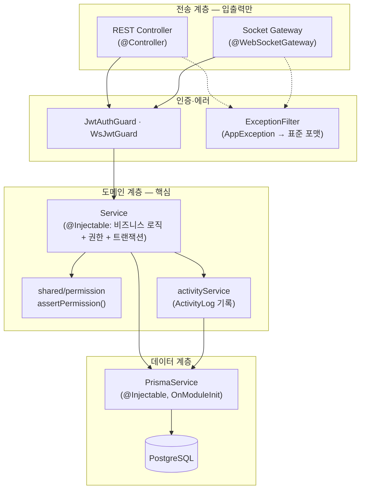

# MarkFlow 백엔드 아키텍처 (Backend Architecture)

| 항목 | 내용 |
| --- | --- |
| 문서 유형 | 백엔드 아키텍처 설계 |
| 프로젝트 | MarkFlow — 마크다운 노드 기반 실시간 협업 캔버스 |
| 버전 / 상태 | v1.0 / Draft |
| 작성일 | 2026-06-24 |
| 스택 | Node.js + NestJS + Socket.io + Prisma + PostgreSQL + TypeScript |

> 한 줄 정의 — **레이어드(서비스) 아키텍처**. 비즈니스 로직을 전송 계층(REST/Socket)에서 분리해, REST 컨트롤러와 Socket 핸들러가 **같은 서비스 함수**를 호출한다. 풀 클린 아키텍처의 격식(Entity/UseCase/Repository 인터페이스/DI)은 4주 MVP 범위에서 채택하지 않는다.

---

## 0. 설계 원칙

1. **로직 ≠ 전송** — 비즈니스 로직·권한·로그는 **Service**에만. Controller/Gateway는 입력 파싱·서비스 호출·응답 포맷만.
2. **단일 진실원(seam)** — 같은 mutation(노드 생성 등)은 REST든 Socket이든 **하나의 서비스 함수**로 수렴. 코드·정합성·ActivityLog 중복 방지.
3. **서버가 진짜 가드** — 권한은 REST·Socket 양쪽 서버에서 검사(PRD §6). 프론트 비활성화는 UX용.
4. **얇게 유지** — Repository 인터페이스 추상화 없음(Prisma가 곧 데이터 접근 계층). 격식보다 데모 동작 우선.
5. **트랜잭션 경계 = 서비스 메서드** — 변경 + ActivityLog 기록은 한 트랜잭션.

---

## 1. 레이어 구조



| 계층 | 책임 | 금지 |
| --- | --- | --- |
| **Controller(`@Controller`) / Gateway(`@WebSocketGateway`)** | HTTP/WS 입출력, DTO 검증, 서비스 호출, 응답·브로드캐스트 | Prisma 직접 호출 ✗, 권한 if문 ✗, 비즈니스 로직 ✗ |
| **Service(`@Injectable` provider)** | 비즈니스 로직, 권한 검사, 트랜잭션, ActivityLog | HTTP/WS 객체(req/res/socket) 의존 ✗ |
| **PrismaService** | DB 접근 | — |

---

## 2. 폴더 구조

```
src/
  main.ts                # NestFactory.create(AppModule) + enableCors + listen(PORT)
  app.module.ts          # 루트 모듈(@Module) — 도메인 모듈·PrismaModule·gateway 등록
  config/
    env.ts               # 환경변수 로드·검증(zod)
  prisma/
    prisma.service.ts    # PrismaClient(@Injectable, OnModuleInit)
    prisma.module.ts     # @Global — PrismaService 전역 제공
  common/
    guards/
      jwt-auth.guard.ts  # JwtAuthGuard — JWT 검증 → request.user (REST)
    filters/
      app-exception.filter.ts  # ExceptionFilter — AppException → 표준 에러 응답(09-API-Spec.md §0.3)
    app.exception.ts     # AppException(code, status)
  shared/
    permission.ts        # assertPermission(projectId, userId, minRole)  ← REST·Socket 공용
    dto/
      index.ts           # shared zod 스키마 재export(요청 검증, 양쪽 재사용)
  modules/
    auth/        auth.controller.ts   auth.service.ts      (auth.module.ts)
    projects/    project.controller.ts project.service.ts  (projects.module.ts)
    members/     member.controller.ts member.service.ts    (members.module.ts)
    nodes/       node.controller.ts   node.service.ts       (nodes.module.ts)   # ← 공유 seam
    edges/       edge.controller.ts   edge.service.ts       (edges.module.ts)   # ← 공유 seam
    chat/        chat.controller.ts   chat.service.ts       (chat.module.ts)    # ← 공유 seam
    activity/    activity.controller.ts activity.service.ts (activity.module.ts)
  realtime/
    canvas.gateway.ts    # @WebSocketGateway — node:/edge:/cursor:/lock: 이벤트 → service 호출
    chat.gateway.ts      # @WebSocketGateway — chat: 이벤트 → chatService 호출
    ws-jwt.guard.ts      # WsJwtGuard — WS 핸드셰이크 JWT 검증 → socket.data.user
    presence.ts          # 커서·소프트락(in-memory, DB 불필요)
    rooms.ts             # roomOf(projectId) = `project:<id>`
prisma/
  schema.prisma          # 08-ERD.md/08-ERD.dbml 기준
  migrations/
```

> Controller/Gateway 1쌍당 `<도메인>.module.ts`로 묶어 `app.module.ts`에 등록한다. Socket.io는 `@nestjs/platform-socket.io` 기본 IoAdapter로 같은 HTTP 서버에 attach된다.

**소유권**: 백엔드 전체 = **BE 1명**(`modules/*`·`shared/`·`prisma/`·`realtime/*`). REST 컨트롤러와 소켓 게이트웨이는 둘 다 같은 service(`@Injectable` provider)를 **호출만** 한다(전송≠로직).

---

## 3. 핵심 패턴: 서비스 seam

같은 로직을 REST와 Socket이 따로 구현하면 ActivityLog 누락·정합성 붕괴가 생긴다. **service 1곳**으로 수렴시킨다.

```ts
// modules/nodes/node.service.ts  — 전송 수단에 무관(seam)
@Injectable()
export class NodeService {
  constructor(private prisma: PrismaService) {}

  async create(input: CreateNodeInput, actor: Actor) {
    await assertPermission(input.projectId, actor.userId, 'EDITOR');     // 권한도 여기
    return this.prisma.$transaction(async (tx) => {                       // 변경 + 로그 = 1 트랜잭션
      const node = await tx.node.create({ data: input });
      await activityService.record(tx, {
        projectId: input.projectId, userId: actor.userId,
        targetType: 'NODE', targetId: node.id, action: 'CREATE',
      });
      return node;
    });
  }
  // update(MOVE/UPDATE 판별) / softDelete(+엣지 물리삭제) / restore / purge ...
}
```

```ts
// REST 전송 — modules/nodes/node.controller.ts
@Controller('projects/:projectId/nodes')
@UseGuards(JwtAuthGuard)
export class NodeController {
  constructor(private nodeService: NodeService) {}

  @Post()
  create(@Param('projectId') projectId: string, @Body() body, @Req() req) {
    return this.nodeService.create(parseCreateNode(projectId, body), actorOf(req));
  }
}
```

```ts
// Socket 전송 — realtime/canvas.gateway.ts
@WebSocketGateway()
@UseGuards(WsJwtGuard)
export class CanvasGateway {
  constructor(private nodeService: NodeService) {}        // ← 같은 provider 주입

  @SubscribeMessage('node:add')
  async onNodeAdd(@MessageBody() payload, @ConnectedSocket() socket) {
    const node = await this.nodeService.create(payload, actorOf(socket));   // ← 같은 함수
    socket.to(roomOf(payload.projectId)).emit('node:added', node);          // 타인에게 broadcast
    return { ok: true, node };                                               // ack
  }
}
```

> 결과: 노드가 REST로 들어오든 소켓으로 들어오든 **권한 검사·DB 반영·ActivityLog가 동일**하게 처리된다.

---

## 4. 실시간(Socket.io) 설계

> 전제: **Socket.io 직접 구현**(정본). 막힐 시 동일 CollabAPI 뒤에서 Liveblocks(차선)로 교체 — 이벤트 규격은 `09-API-Spec.md §7` 참조.

- **연결 1개 · 룸 1개**: `room = project:<projectId>`. 채팅·캔버스를 **분리하지 않고** 같은 룸에서 이벤트 이름으로 구분(화면설계서 §3.3 "채팅=캔버스 룸").
- **네임스페이스 분리 안 함**: 기본 네임스페이스 + room으로 충분.
- **게이트웨이 파일만 분리**: `canvas.gateway.ts` / `chat.gateway.ts`(둘 다 `@WebSocketGateway`)가 기본 네임스페이스·같은 룸에서 동작. Socket.io는 `@nestjs/platform-socket.io` 기본 IoAdapter로 부트스트랩된다.

```ts
// realtime/canvas.gateway.ts (chat.gateway.ts도 동일 패턴)
@WebSocketGateway()
@UseGuards(WsJwtGuard)                       // 핸드셰이크 JWT 검증 → socket.data.user
export class CanvasGateway {
  @SubscribeMessage('node:add') /* ... node:/edge:/cursor:/lock: ... */
}
```

| prefix | 이벤트 | 영속화 |
| --- | --- | --- |
| `sync:` | `sync:init`(접속 시 현재 상태), `sync:resync`(재접속) | 조회 |
| `cursor:` | `cursor:move`(≈50ms throttle) | ✗ in-memory |
| `node:` | `node:add/update/move/delete` → `*:ed` broadcast | nodeService |
| `edge:` | `edge:add/delete` | edgeService |
| `lock:` | `lock:acquire/release`("OO 편집 중") | ✗ in-memory(presence) |
| `chat:` | `chat:message`, `chat:typing` | chatService |

- **잔버그 3종 집중**(PROPOSAL): ① 초기 싱크 ② 끊김 재접속 ③ 이벤트 순서. `sync:init`을 1순위로.
- **last-write-wins**: 노드 단위 충돌이 적어 단순 덮어쓰기. 동시 텍스트 편집은 소프트락으로 회피(CRDT 미사용).

---

## 5. 권한 가드 전략

`shared/permission.ts` 한 함수를 REST·Socket이 공유한다(PRD §6).

```ts
export async function assertPermission(projectId, userId, min: Role) {
  const m = await prisma.projectMember.findUnique({
    where: { projectId_userId: { projectId, userId } },
  });
  if (!m) throw new AppException('FORBIDDEN', 403);
  if (rank(m.role) < rank(min)) throw new AppException('FORBIDDEN', 403);  // VIEWER<EDITOR<OWNER
}
```

| 지점 | 적용 |
| --- | --- |
| REST | `JwtAuthGuard`(JWT) + 서비스 진입부 `assertPermission` |
| Socket | `WsJwtGuard` 핸드셰이크 JWT 검증·룸 입장 role 확인 + **변경 이벤트마다** 서비스 진입부에서 재검사 |

> 권한은 **서비스 진입부**에서 검사하므로, 전송 계층이 무엇이든 자동으로 가드된다.

---

## 6. 트랜잭션 & ActivityLog 경계

- 변경 + 로그는 **항상 한 `$transaction`**. 예: 노드 휴지통 이동 = `node.deletedAt 설정` + `연결 엣지 물리삭제` + `ActivityLog(DELETE)`.
- ActivityLog는 폴리모픽(NODE/EDGE/PROJECT). 기록은 `activityService.record(tx, ...)`로 서비스 내부에서. (ERD §2.7)
- 표시 라벨은 read 시점 조인 + 폴백("(삭제된 항목)").

---

## 7. 에러 처리 · 검증 · 설정

- **에러**: 서비스는 `AppException(code, status)` throw → `ExceptionFilter`(`common/filters/app-exception.filter.ts`)가 표준 포맷으로 변환(09-API-Spec.md §0.3). Socket은 `ack({ ok:false, error })`로 반환.
- **검증**: `shared/dto`에 zod 스키마 1벌 정의 → controller·gateway에서 재사용(REST body = socket payload 동일 형태). `ValidationPipe` 또는 핸들러 진입부에서 `schema.parse()`.
- **설정**: `config/env.ts`에서 `DATABASE_URL`, `JWT_SECRET`, `JWT_EXPIRES_IN`(예: 7d), `PORT`, `CORS_ORIGIN`을 zod로 검증 후 주입. JWT 발급/검증은 `@nestjs/jwt`.
- **부트스트랩**: `main.ts`에서 `NestFactory.create(AppModule)` + `enableCors` + `listen(PORT)`. Socket.io는 `@nestjs/platform-socket.io` 기본 IoAdapter로 같은 HTTP 서버에 attach되며, WS 핸드셰이크 인증은 `WsJwtGuard`가 담당.

---

## 8. 역할 소유권 맵

백엔드는 **BE 1명**이 전부 담당한다. 폴더는 구현 순서(권장)로 정리:

| 영역 | 폴더 | 권장 순서 |
| --- | --- | --- |
| Prisma 스키마·마이그레이션 | `prisma/` | 1주차 최우선 |
| 공유 DTO·계약 | `shared/dto`, `packages/shared` | 1주차 최우선(FE 차단 해제) |
| 인증·프로젝트·멤버·권한 | `modules/auth,projects,members`, `shared/permission` | 1주차 |
| 노드·엣지·채팅·활동 서비스 + REST | `modules/nodes,edges,chat,activity` | 2주차 |
| 소켓 인프라·게이트웨이·프레즌스 | `realtime/*` | 3주차(서비스 재사용) |
| 공통 에러·설정·가드 | `common`, `config`, `prisma` | 상시 |

> Day 1 합의(BE→FE 계약): ① Prisma 스키마 ② `assertPermission` 시그니처 ③ 서비스 시그니처(node/edge/chat/activity) ④ DTO·CollabAPI 인터페이스. **BE가 1주차에 스키마 + 서비스 스텁 + DTO를 최우선 제공**하면 FE 둘이 막히지 않는다. 소켓(`realtime/*`)은 서비스 레이어를 재사용하므로 REST보다 뒤에 와도 된다.

---

## 9. 의존성 흐름 규칙 (요약)

```
Controller / Gateway  ─→  Service  ─→  Prisma
        │                   │
        └── 검증(dto)        └── permission · activity · transaction
```

- 화살표는 **단방향**. Service는 Controller/Gateway/socket을 모른다(테스트 용이).
- Gateway는 Service를 알지만, Service는 Gateway를 모른다 → 실시간 구현체(Socket.io↔Liveblocks) 교체해도 Service 불변.

---

## 관련 문서

- API 명세서 — `09-API-Spec.md`
- 데이터 모델 — `08-ERD.md` / `08-ERD.dbml`
- PRD — `02-PRD.md` / 기획서 — `01-Proposal.md` / 화면 설계서 — `04-Screen-Design.md`
