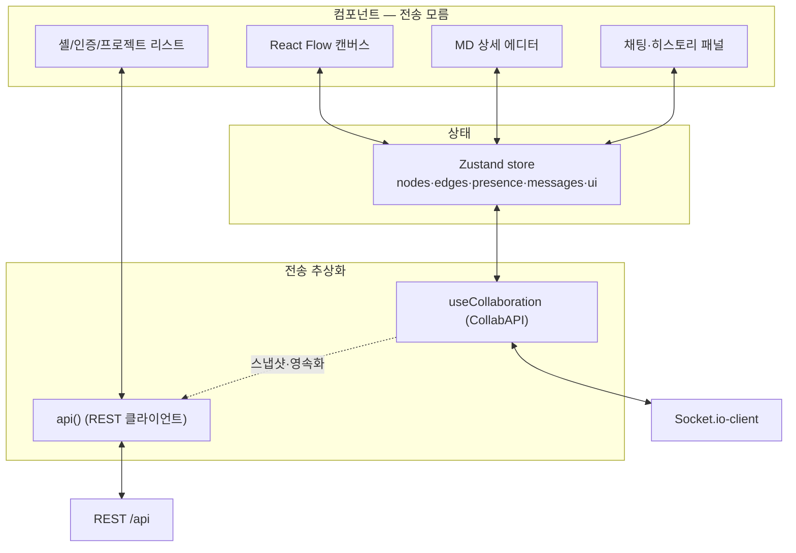

# MarkFlow 프론트엔드 아키텍처 (Frontend Architecture)

| 항목 | 내용 |
| --- | --- |
| 문서 유형 | 프론트엔드 아키텍처 설계 |
| 프로젝트 | MarkFlow — 마크다운 노드 기반 실시간 협업 캔버스 |
| 버전 / 상태 | v1.0 / Draft |
| 작성일 | 2026-06-24 |
| 스택 | React + TypeScript + Vite + React Flow + Zustand + Tailwind + Socket.io-client |

> 한 줄 정의 — **레이어드 + 추상화 아키텍처**. 소켓·REST 같은 전송 계층을 `useCollaboration`(CollabAPI)·API 클라이언트 뒤에 숨기고, 모든 상태는 **Zustand 단일 스토어**로 모은다. 컴포넌트는 전송을 모르고 store만 구독한다. 백엔드(`06-Backend-Architecture.md`)의 "로직≠전송" 원칙과 대칭.

---

## 0. 설계 원칙

1. **전송 은닉** — 소켓/REST를 컴포넌트에 직접 박지 않는다. `useCollaboration`(실시간)·`api()`(REST) 뒤에 둔다.
2. **단일 진실원** — nodes/edges/presence/messages는 **Zustand store** 하나로. React Flow·MD 에디터·실시간 수신이 모두 store를 거친다.
3. **교체 가능성** — 실시간 구현체(Socket.io 정본 ↔ Liveblocks 차선)를 CollabAPI 뒤에서 교체해도 UI 코드는 불변.
4. **낙관적 업데이트 + 에코 루프 차단** — 내 액션만 emit, 원격 수신은 store에 적용만.
5. **권한은 UX용** — 프론트 비활성화는 편의일 뿐, 진짜 가드는 서버(403). (`02-PRD.md` §6)

---

## 1. 레이어 구조



| 계층 | 책임 | 비고 |
| --- | --- | --- |
| 컴포넌트 | 렌더·사용자 입력 | store 구독 + 액션 호출만. 소켓/fetch 직접 호출 ✗ |
| Zustand store | 단일 상태 + 로컬/원격 적용 분리 | `applyLocal*`(반영+emit) / `applyRemote*`(반영만) |
| useCollaboration | 실시간 송수신 추상화(CollabAPI) | Socket.io ↔ Liveblocks 교체점 |
| api() | REST 호출 + 토큰·401 인터셉터 | 인증·프로젝트·스냅샷·일괄저장 |

---

## 2. 폴더 구조

```
src/
  lib/
    api.ts              # fetch 래퍼 + Bearer 부착 + 401 인터셉터
    socket.ts           # Socket.io-client 단일 인스턴스
  store/
    canvasStore.ts      # nodes·edges (+ applyLocal/applyRemote)
    presenceStore.ts    # 커서·접속자·소프트락
    chatStore.ts        # 메시지·typing
    authStore.ts        # 토큰·user
  collab/
    CollabAPI.ts        # 인터페이스(타입)
    useCollaboration.ts # 구현체 선택 훅
    useSocketCollab.ts  # Socket.io 구현(정본)
    useLiveblocksCollab.ts # 차선(스텁)
  features/
    auth/               # 로그인·회원가입
    projects/           # 프로젝트 리스트·휴지통
    canvas/             # React Flow, 커스텀 노드, 미니맵, 줌
    node-editor/        # 전체화면 MD 에디터
    panel/              # 우측 채팅·히스토리 탭, 채팅 FAB
    trash/              # 휴지통 아코디언
  components/           # 공용 UI(헤더·버튼·모달)
  routes/               # 라우팅 + 인증 가드
  types/                # 노드 DTO 등 (백엔드와 공유 형태)
```

**소유권**: `canvas/`·`node-editor` 일부·`collab/`·`store/canvas,presence` = **F1** / `auth/`·`projects/`·`panel/`·`trash/`·`lib/api`·셸 = **F2**. (세부 → `10-Team-Roles.md`)

---

## 3. 상태 관리 (Zustand)

```ts
// store/canvasStore.ts
interface CanvasState {
  nodes: RFNode[]; edges: RFEdge[];
  // 내 액션: 반영 + emit
  applyLocalNode(n: RFNode): void;
  // 원격 수신: 반영만(emit ✗) — 에코 루프 차단
  applyRemoteNode(n: RFNode): void;
  removeNode(id: string): void;
  initCanvas(snap: { nodes; edges }): void;
}
```

- React Flow는 store의 `nodes/edges`를 렌더. `onNodesChange`는 로컬 액션만 store→emit로 연결.
- 좌표·내용은 `08-ERD.md §6` 매핑(`position {x,y}` ↔ `posX/posY`).

---

## 4. 실시간 처리 — 7원칙

| # | 원칙 | 메모 |
| --- | --- | --- |
| 1 | 연결 1개, 중앙 관리 | `lib/socket.ts` 단일 인스턴스 |
| 2 | CollabAPI로 추상화 | Socket.io↔Liveblocks 교체점 |
| 3 | 캔버스 진입 connect, 이탈 disconnect | 룸 = `project:<id>` |
| 4 | 이벤트 → store 단방향 주입 | 컴포넌트는 store만 구독 |
| 5 | 낙관적 + 에코 루프 차단 | 원격 수신은 적용만, 내 액션만 emit |
| 6 | throttle/debounce | 커서 ≈50ms, 저장 ≈2s |
| 7 | 재접속 = 자동재연결 + resync | `sync:resync` 수신 시 상태 복구 |

### 에코 루프 방지 (가장 흔한 버그)

```ts
// 원격 수신: emit 없이 store만 (조용히 반영)
socket.on('node:updated', (n) => canvasStore.applyRemoteNode(n));

// 내 액션: store + emit
function onNodeDragStop(node) {
  canvasStore.applyLocalNode(node);
  collab.emitNode({ type: 'move', node });   // ← 여기서만 emit
}
```

> React Flow `onNodesChange`는 내 드래그와 원격 적용 둘 다에서 발생한다. `applyLocal`/`applyRemote` 분리로 무한 반사를 막는다.

### CollabAPI 인터페이스

```ts
export interface CollabAPI {
  connect(projectId: string): void;
  disconnect(): void;
  emitNode(c: NodeChange): void;
  emitEdge(c: EdgeChange): void;
  emitCursor(p: XY): void;
  emitLock(nodeId: string | null): void;
  sendChat(content: string): void;
  // 수신은 내부에서 구독 → store 주입 (컴포넌트는 store만 봄)
}
```

이벤트 규격 상세 → `09-API-Spec.md §7`.

---

## 5. REST 클라이언트 & 인증

```ts
// lib/api.ts — 한 곳에서 토큰 부착 + 401 처리
async function api<T>(path, init = {}) {
  const res = await fetch(`${BASE}${path}`, {
    ...init,
    headers: { 'Content-Type': 'application/json',
      ...(token ? { Authorization: `Bearer ${token}` } : {}), ...init.headers },
  });
  if (res.status === 401) { clearToken(); location.href = '/login'; throw …; }
  const body = res.status === 204 ? null : await res.json();
  if (!res.ok) throw new ApiError(res.status, body?.error);
  return body;
}
```

- 컴포넌트마다 헤더 만들지 않는다. 인터셉터 1곳(`api()`)에서 Bearer·401 일괄 처리.

---

## 6. 권한 기반 UI 분기

```ts
const canEdit = role === 'OWNER' || role === 'EDITOR';
const canManage = role === 'OWNER';
<button disabled={!canEdit} onClick={addNode}>+ 노드</button>
{canManage && <ProjectSettings />}
```

- 비활성화는 UX용. 서버가 최종 가드(`09-API-Spec.md §0.4`).

---

## 7. 캔버스 저장 전략

| 경로 | 시점 | 방식 |
| --- | --- | --- |
| 실시간(소켓) | 변경 즉시 | 낙관적 반영 + `node:*` emit + 타인 broadcast |
| REST 개별 | 단일 액션 | `POST/PATCH/DELETE` |
| REST 일괄 | debounce ≈2s + 수동 저장 | `PUT /canvas` |

> 화면 즉시 반영 = 소켓, DB 영속화 = 2초 debounce. (`05-Tech-Spec.md §6`)

---

## 8. 화면 ↔ 모듈 매핑

| 화면(스크린샷) | 모듈 | 담당 |
| --- | --- | --- |
| `screens/01-landing` | `features/landing` | F2 |
| `screens/02-signup`·`03-login` | `features/auth` | F2 |
| `screens/04-project-list` | `features/projects` | F2 |
| `screens/05-canvas-collapsed` | `features/canvas` + `trash` | F1 |
| `screens/06-canvas-expanded` | `features/panel`(채팅·히스토리) | F2 |
| `screens/07-node-editor` | `features/node-editor` | F2(에디터) / F1(트리거) |

---

## 관련 문서

- 백엔드 아키텍처 — `06-Backend-Architecture.md`
- 역할 분담 — `10-Team-Roles.md`
- API 명세서 — `09-API-Spec.md`
- 데이터 모델 — `08-ERD.md`
- 화면 설계서 — `04-Screen-Design.md` / 기술 설명서 — `05-Tech-Spec.md`
