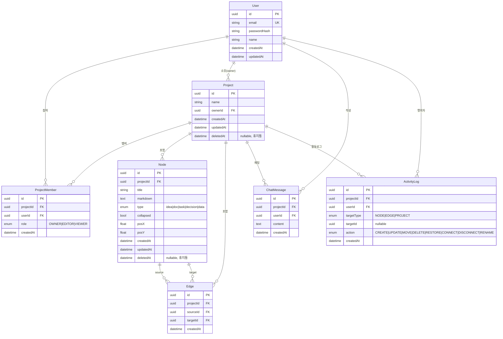

# MarkFlow 데이터 모델 (ERD)

| 항목 | 내용 |
| --- | --- |
| 문서 유형 | 데이터 모델(ERD) — PostgreSQL + Prisma 기준 |
| 프로젝트 | MarkFlow — 마크다운 노드 기반 실시간 협업 캔버스 |
| 버전 / 상태 | v1.1 / Draft (화면 이미지 재검증 반영) |
| 작성일 | 2026-06-24 |

> 한 줄 정의 — 캔버스 본문을 Node/Edge 테이블로 **정규화**한 관계형 스키마. 실시간 동기화·휴지통(소프트 삭제)·활동 로그를 노드/엣지 단위로 다루기 위함이다. (PRD §8 "캔버스 본문은 Node/Edge 테이블로 정규화한다(결정)" 정본)

---

## 0. 설계 결정 (Decision Log 반영)

| # | 결정 | ERD 반영 |
| --- | --- | --- |
| 1 | 권한 3분류 (Owner/Editor/Viewer) | `ProjectMember.role` enum, OWNER는 프로젝트당 1명 |
| 2 | 프로젝트 = 캔버스 (1:1) | 별도 Canvas 테이블 없음. Project가 곧 캔버스 컨테이너 |
| 3 | 히스토리 = 변경 로그만 | `ActivityLog`는 action·시점·작성자만 기록(내용 스냅샷·diff 없음). 노드·엣지·프로젝트 이벤트를 한 타임라인에 포함(화면 `06-canvas-expanded` 반영) |
| 4 | 실시간 협업 포함 | Socket.io 직접 구현(정본). DB는 영속 스냅샷 소스, 실시간 상태와 분리 |
| 5 | JWT 자체 구현 | `User.passwordHash`, JWT는 stateless(테이블 없음, 선택적 RefreshToken) |
| 6 | 채팅 = 프로젝트 단위 | `ChatMessage.projectId` |
| 7 | 임시저장소 + 휴지통 통합 | `deletedAt` 소프트 삭제 단일 메커니즘 + 영구 삭제(휴지통 비우기, 화면 `04-project-list/05-canvas-collapsed` 반영) |

> **저장 전략 메모** — 기획서 초안의 "캔버스 JSONB 통째 저장"은 PRD의 정규화 결정으로 대체한다. 정규화 시 노드 단위 락·히스토리·복구가 자연스럽고, Socket.io 변경 이벤트 ↔ DB 영속화도 노드 row 단위로 매핑된다.

---

## 1. ERD 다이어그램



---

## 2. 엔티티 상세

### 2.1 User — 사용자

| 컬럼 | 타입 | 제약 | 설명 |
| --- | --- | --- | --- |
| id | UUID | PK | 사용자 식별자 |
| email | VARCHAR(255) | UNIQUE, NOT NULL | 로그인 ID. 정규식 `.+@.+\..+` 검증 |
| passwordHash | VARCHAR(255) | NOT NULL | bcrypt/argon2 해시. **평문 비밀번호 저장 금지** |
| name | VARCHAR(60) | NOT NULL | 표시 이름(헤더 아바타 이니셜, 채팅·히스토리 표기) |
| createdAt | TIMESTAMPTZ | NOT NULL, default now() | |
| updatedAt | TIMESTAMPTZ | NOT NULL, @updatedAt | |

- 인덱스: `UNIQUE(email)`
- PRD 매핑: §4.2 인증, §8 User. 비밀번호 응답 직렬화 시 `passwordHash` 절대 노출 금지.

### 2.2 Project — 프로젝트(=캔버스)

| 컬럼 | 타입 | 제약 | 설명 |
| --- | --- | --- | --- |
| id | UUID | PK | |
| name | VARCHAR(120) | NOT NULL | 프로젝트명(=캔버스명). 소유자만 변경 |
| ownerId | UUID | FK→User.id, NOT NULL | 생성자(소유자). 역할 단일 소스는 ProjectMember이나, 빠른 조회·무결성용 비정규화 보관 |
| createdAt | TIMESTAMPTZ | NOT NULL | |
| updatedAt | TIMESTAMPTZ | NOT NULL | |
| deletedAt | TIMESTAMPTZ | NULL | 휴지통(소프트 삭제). NULL = 활성 |

- 인덱스: `INDEX(ownerId)`, `INDEX(deletedAt)`
- 프로젝트 생성 시 트랜잭션으로 `ProjectMember(role=OWNER)` row를 함께 생성한다. (프로젝트 = 캔버스 1:1, 별도 Canvas row 없음)
- PRD 매핑: §4.3, §8 Project.

### 2.3 ProjectMember — 멤버십 / 권한 (역할의 단일 소스)

| 컬럼 | 타입 | 제약 | 설명 |
| --- | --- | --- | --- |
| id | UUID | PK | |
| projectId | UUID | FK→Project.id, NOT NULL, ON DELETE CASCADE | |
| userId | UUID | FK→User.id, NOT NULL | |
| role | ENUM | NOT NULL | `OWNER` / `EDITOR` / `VIEWER` |
| createdAt | TIMESTAMPTZ | NOT NULL | |

- 인덱스: `UNIQUE(projectId, userId)` — 한 유저는 한 프로젝트에 1개 역할
- 부분 유니크: `UNIQUE(projectId) WHERE role = 'OWNER'` — **프로젝트당 OWNER 1명** 보장
- 권한 검사는 이 테이블을 기준으로 REST·실시간 양쪽 서버에서 수행(PRD §6).
- PRD 매핑: §6 권한 모델, §8 ProjectMember.

### 2.4 Node — 마크다운 노드

| 컬럼 | 타입 | 제약 | 설명 |
| --- | --- | --- | --- |
| id | UUID | PK | |
| projectId | UUID | FK→Project.id, NOT NULL, ON DELETE CASCADE | 소속 캔버스 |
| title | VARCHAR(200) | NOT NULL, default '' | 노드 제목(접힘 시 표시) |
| markdown | TEXT | NOT NULL, default '' | .md 본문 |
| type | ENUM | NOT NULL, default 'idea' | `idea`/`doc`/`task`/`decision`/`data` (화면설계서 §1.2 노드 타입 컬러) |
| collapsed | BOOLEAN | NOT NULL, default true | 접기/펼치기 상태(양방향 바인딩) |
| posX | DOUBLE PRECISION | NOT NULL, default 0 | 캔버스 X 좌표 |
| posY | DOUBLE PRECISION | NOT NULL, default 0 | 캔버스 Y 좌표 |
| createdAt | TIMESTAMPTZ | NOT NULL | |
| updatedAt | TIMESTAMPTZ | NOT NULL | |
| deletedAt | TIMESTAMPTZ | NULL | 휴지통(소프트 삭제) |

- 인덱스: `INDEX(projectId, deletedAt)` — 활성 노드 목록 조회 최적화
- 좌표는 `posX/posY` 두 컬럼으로 분리(React Flow `position: {x, y}`와 매핑). JSON 단일 컬럼 대신 정렬·쿼리 용이.
- PRD 매핑: §4.4.1/§4.4.2, §8 Node.

### 2.5 Edge — 노드 연결

| 컬럼 | 타입 | 제약 | 설명 |
| --- | --- | --- | --- |
| id | UUID | PK | |
| projectId | UUID | FK→Project.id, NOT NULL, ON DELETE CASCADE | |
| sourceId | UUID | FK→Node.id, NOT NULL, ON DELETE CASCADE | 시작 노드(화살표 출발) |
| targetId | UUID | FK→Node.id, NOT NULL, ON DELETE CASCADE | 도착 노드(화살표 방향) |
| createdAt | TIMESTAMPTZ | NOT NULL | |

- 인덱스: `INDEX(projectId)`, `UNIQUE(sourceId, targetId)` — 동일 방향 중복 엣지 방지
- 제약: `CHECK(sourceId <> targetId)` — 자기 자신 연결 금지
- 노드가 휴지통으로 가면(소프트 삭제) 연결된 엣지는 **물리 삭제**한다(화면설계서 §4.4.5 "노드+연결 엣지 제거"). 복구 시 엣지는 복원되지 않음(범위 밖).
- PRD 매핑: §4.4.1, §8 Edge.

### 2.6 ChatMessage — 프로젝트 단위 채팅

| 컬럼 | 타입 | 제약 | 설명 |
| --- | --- | --- | --- |
| id | UUID | PK | |
| projectId | UUID | FK→Project.id, NOT NULL, ON DELETE CASCADE | 채팅방(=캔버스 룸) |
| userId | UUID | FK→User.id, NOT NULL | 작성자 |
| content | TEXT | NOT NULL | 메시지 본문 |
| createdAt | TIMESTAMPTZ | NOT NULL | 정렬 기준 |

- 인덱스: `INDEX(projectId, createdAt)` — 시간순 페이지네이션
- 우측 패널 탭 채팅 = 우하단 토글 채팅 = 같은 방(화면설계서 §3.3).
- PRD 매핑: §4.4.3, §8 ChatMessage.

### 2.7 ActivityLog — 활동 로그 (변경 로그, 복원·diff 없음)

> 화면 `06-canvas-expanded`의 히스토리 타임라인에 노드 생성/삭제뿐 아니라 **엣지 연결("…노드 연결됨")·프로젝트 제목 변경** 이벤트가 함께 표시된다. 이를 한 타임라인으로 담기 위해 노드 전용 `NodeHistory`를 **프로젝트 단위 폴리모픽 `ActivityLog`로 일반화**한다.

| 컬럼 | 타입 | 제약 | 설명 |
| --- | --- | --- | --- |
| id | UUID | PK | |
| projectId | UUID | FK→Project.id, NOT NULL, ON DELETE CASCADE | 프로젝트 단위 타임라인 |
| userId | UUID | FK→User.id, NOT NULL | 행위자 |
| targetType | ENUM | NOT NULL | `NODE` / `EDGE` / `PROJECT` |
| targetId | UUID | NULL | 대상 엔티티 id(폴리모픽, FK 아님). 특정 대상이 없는 이벤트에만 NULL. **로그는 불변** — 대상이 영구 삭제돼도 기록 시점 값을 그대로 유지(댕글링 참조 허용) |
| action | ENUM | NOT NULL | `CREATE`/`UPDATE`/`MOVE`/`DELETE`/`RESTORE`/`CONNECT`/`DISCONNECT`/`RENAME` |
| createdAt | TIMESTAMPTZ | NOT NULL | |

- 인덱스: `INDEX(projectId, createdAt)`(전체 타임라인), `INDEX(targetType, targetId, createdAt)`(노드별 히스토리 조회)
- **내용 스냅샷·diff는 저장하지 않는다**(PRD 결정 #3). "누가·언제·무엇에·무슨 액션"만.
- `targetId`는 폴리모픽 참조라 DB FK 제약을 걸지 않는다(타입별 무결성은 애플리케이션에서 보장). 노드별 히스토리(`§5.1`)는 `WHERE targetType='NODE' AND targetId=:nodeId`로 조회.
- 표시 라벨(노드 제목 등)은 read 시점 조인으로 조립한다. 대상이 영구 삭제돼 조인이 비면 폴백 라벨("(삭제된 항목)")을 내려준다. (선택 강화: 라벨을 로그 row에 비정규화 스냅샷으로 저장하면 영구 삭제 후에도 타임라인이 온전. 내용 본문은 여전히 저장 안 함 — PRD #3.)
- targetType별 사용 action 가이드:
  - `NODE`: CREATE · UPDATE · MOVE · DELETE · RESTORE
  - `EDGE`: CONNECT · DISCONNECT
  - `PROJECT`: RENAME · DELETE · RESTORE
- PRD 매핑: §4.4.4(노드 히스토리) + 화면 `06-canvas-expanded`(엣지·프로젝트 이벤트 확장). PRD의 "노드 히스토리"는 ActivityLog를 `targetType='NODE'`로 필터한 뷰에 해당.

### 2.8 인증 토큰 정책 (RefreshToken 미채택)

- MVP는 **액세스 토큰(JWT)만** 사용한다(PRD 결정 #5: stateless). 별도 토큰 테이블 없음.
- 액세스 토큰 만료시간은 넉넉히(예: 7일) 두고, 만료 시 재로그인. 강제 로그아웃·다중기기 세션 관리는 범위 밖.
- **(향후 확장)** 강제 로그아웃/토큰 회전이 필요해지면 `RefreshToken(id, userId FK, tokenHash, expiresAt, createdAt)` 테이블을 추가한다. 현재 ERD·다이어그램·Prisma 스키마에는 포함하지 않는다.

---

## 3. 관계 요약

| 관계 | 카디널리티 | 비고 |
| --- | --- | --- |
| User ↔ Project (owner) | 1 : N | `Project.ownerId` |
| User ↔ ProjectMember | 1 : N | 참여 프로젝트들 |
| Project ↔ ProjectMember | 1 : N | 멤버 목록 (OWNER 1명 강제) |
| Project ↔ Node | 1 : N | 캔버스 노드들 (CASCADE) |
| Project ↔ Edge | 1 : N | 캔버스 엣지들 (CASCADE) |
| Node ↔ Edge | 1 : N (source/target 각각) | 연결 |
| Project ↔ ChatMessage | 1 : N | 채팅 로그 |
| Project ↔ ActivityLog | 1 : N | 활동 로그(노드·엣지·프로젝트 이벤트) |
| User ↔ ActivityLog | 1 : N | 행위자 |

---

## 4. 소프트 삭제 / 휴지통 정책

- `deletedAt`이 있는 엔티티: **Project, Node** (PRD 결정 #7 통합 휴지통).
- 활성 조회는 항상 `WHERE deletedAt IS NULL`. Prisma 미들웨어 또는 명시 필터로 일관 적용.
- 복구: `deletedAt = NULL`. 휴지통 리스트는 `WHERE deletedAt IS NOT NULL` (화면설계서 §4.4.5 아코디언).
- 노드 삭제 시 연결 엣지는 물리 삭제(복구 대상 아님). 활동 로그에 `DELETE`/`RESTORE` 기록.
- **영구 삭제(휴지통 비우기)** — 화면 `04-project-list`(프로젝트 컨텍스트 메뉴 "삭제" + 휴지통 페이지 복구 안내) 및 `05-canvas-collapsed`(캔버스 휴지통)에서 확인. 소프트 삭제된 항목을 휴지통에서 **물리 삭제(hard delete)** 할 수 있다:
  - 프로젝트 영구 삭제 시 하위 Node·Edge·ChatMessage·ActivityLog가 CASCADE로 함께 제거된다(소유자만).
  - 노드 영구 삭제 시 해당 노드와 잔여 관계가 제거된다. ActivityLog는 불변이므로 `targetId`(댕글링)와 함께 그대로 보존(감사 추적). 조회 시 폴백 라벨 처리(§2.7).
- 자동 보존 기간(예: 30일 후 자동 영구 삭제)은 범위 밖. 필요 시 배치로 추가.

---

## 5. Prisma 스키마 (초안)

```prisma
// schema.prisma
generator client {
  provider = "prisma-client-js"
}

datasource db {
  provider = "postgresql"
  url      = env("DATABASE_URL")
}

enum Role {
  OWNER
  EDITOR
  VIEWER
}

enum NodeType {
  idea
  doc
  task
  decision
  data
}

enum ActivityTarget {
  NODE
  EDGE
  PROJECT
}

enum ActivityAction {
  CREATE
  UPDATE
  MOVE
  DELETE
  RESTORE
  CONNECT
  DISCONNECT
  RENAME
}

model User {
  id           String          @id @default(uuid()) @db.Uuid
  email        String          @unique
  passwordHash String
  name         String
  createdAt    DateTime        @default(now())
  updatedAt    DateTime        @updatedAt

  ownedProjects Project[]      @relation("ProjectOwner")
  memberships   ProjectMember[]
  messages      ChatMessage[]
  activities    ActivityLog[]
}

model Project {
  id        String   @id @default(uuid()) @db.Uuid
  name      String
  ownerId   String   @db.Uuid
  createdAt DateTime @default(now())
  updatedAt DateTime @updatedAt
  deletedAt DateTime?

  owner      User            @relation("ProjectOwner", fields: [ownerId], references: [id])
  members    ProjectMember[]
  nodes      Node[]
  edges      Edge[]
  messages   ChatMessage[]
  activities ActivityLog[]

  @@index([ownerId])
  @@index([deletedAt])
}

model ProjectMember {
  id        String   @id @default(uuid()) @db.Uuid
  projectId String   @db.Uuid
  userId    String   @db.Uuid
  role      Role
  createdAt DateTime @default(now())

  project Project @relation(fields: [projectId], references: [id], onDelete: Cascade)
  user    User    @relation(fields: [userId], references: [id], onDelete: Cascade)

  @@unique([projectId, userId])
  // 부분 유니크(프로젝트당 OWNER 1명)는 raw SQL 마이그레이션으로 추가:
  // CREATE UNIQUE INDEX project_single_owner ON "ProjectMember"("projectId") WHERE role = 'OWNER';
}

model Node {
  id        String    @id @default(uuid()) @db.Uuid
  projectId String    @db.Uuid
  title     String    @default("")
  markdown  String    @default("")
  type      NodeType  @default(idea)
  collapsed Boolean   @default(true)
  posX      Float     @default(0)
  posY      Float     @default(0)
  createdAt DateTime  @default(now())
  updatedAt DateTime  @updatedAt
  deletedAt DateTime?

  project     Project @relation(fields: [projectId], references: [id], onDelete: Cascade)
  outgoing    Edge[]  @relation("EdgeSource")
  incoming    Edge[]  @relation("EdgeTarget")

  @@index([projectId, deletedAt])
}

model Edge {
  id        String   @id @default(uuid()) @db.Uuid
  projectId String   @db.Uuid
  sourceId  String   @db.Uuid
  targetId  String   @db.Uuid
  createdAt DateTime @default(now())

  project Project @relation(fields: [projectId], references: [id], onDelete: Cascade)
  source  Node    @relation("EdgeSource", fields: [sourceId], references: [id], onDelete: Cascade)
  target  Node    @relation("EdgeTarget", fields: [targetId], references: [id], onDelete: Cascade)

  @@unique([sourceId, targetId])
  @@index([projectId])
}

model ChatMessage {
  id        String   @id @default(uuid()) @db.Uuid
  projectId String   @db.Uuid
  userId    String   @db.Uuid
  content   String
  createdAt DateTime @default(now())

  project Project @relation(fields: [projectId], references: [id], onDelete: Cascade)
  user    User    @relation(fields: [userId], references: [id])

  @@index([projectId, createdAt])
}

model ActivityLog {
  id         String         @id @default(uuid()) @db.Uuid
  projectId  String         @db.Uuid
  userId     String         @db.Uuid
  targetType ActivityTarget
  targetId   String?        @db.Uuid   // 폴리모픽 참조(NODE/EDGE/PROJECT). FK 제약 없음
  action     ActivityAction
  createdAt  DateTime       @default(now())

  project Project @relation(fields: [projectId], references: [id], onDelete: Cascade)
  user    User    @relation(fields: [userId], references: [id])

  @@index([projectId, createdAt])
  @@index([targetType, targetId, createdAt])
}
```

---

## 6. 직렬화 매핑 (React Flow ↔ DB)

React Flow는 `{ nodes, edges }`를 다룬다. DB row ↔ 프론트 객체 매핑:

```ts
// Node row → React Flow node
{
  id: node.id,
  type: 'markdown',                 // 커스텀 노드 컴포넌트 1종
  position: { x: node.posX, y: node.posY },
  data: {
    title: node.title,
    markdown: node.markdown,
    nodeType: node.type,            // idea|doc|task|decision|data
    collapsed: node.collapsed,
  },
}

// Edge row → React Flow edge
{
  id: edge.id,
  source: edge.sourceId,
  target: edge.targetId,
  markerEnd: { type: 'arrowclosed' },
}
```

- `{ nodes, edges }` JSON 직렬화 저장(PRD §4.4.1)은 **정규화 테이블을 조합해 생성**하는 응답 형태이며, 저장 자체는 row 단위로 이뤄진다.
- 정본(Socket.io): 클라이언트가 위 프론트 객체를 낙관적으로 들고 `node:*`/`edge:*` 이벤트를 송신하면, 서버가 service를 통해 debounce(약 2초) 시 DB row로 영속화한다.

---

## 관련 문서

- PRD — `02-PRD.md`
- 기획서 — `01-Proposal.md`
- 화면 설계서 — `04-Screen-Design.md`
- API 명세서 — `09-API-Spec.md`
