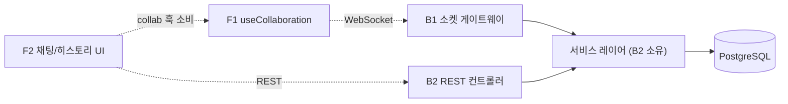

# MarkFlow 역할 분담 (Team Roles)

| 항목 | 내용 |
| --- | --- |
| 문서 유형 | 역할 분담 / 협업 가이드 |
| 프로젝트 | MarkFlow — 마크다운 노드 기반 실시간 협업 캔버스 |
| 버전 / 상태 | v1.0 / Draft |
| 팀 / 기간 | 4인 (백엔드 2 · 프론트 2) / 4주 |
| 작성일 | 2026-06-24 |

> 한 줄 정의 — 백엔드는 **소켓 ↔ REST**, 프론트는 **캔버스/실시간 ↔ 셸/콘텐츠**로 가른다. 짝(BE-B1↔FE-F1 실시간, BE-B2↔FE-F2 도메인)이 맞아 통합이 매끄럽다.

---

## 0. 구성 한눈에

| 코드 | 역할 | 핵심 영역 | 짝 |
| --- | --- | --- | --- |
| **B1** | 백엔드 · 실시간 | Socket.io 게이트웨이·동기화·락·프레즌스 | F1 |
| **B2** | 백엔드 · 도메인 | Prisma·서비스·REST·권한 | F2 |
| **F1** | 프론트 · 캔버스/실시간 | React Flow·노드·`useCollaboration`·멀티커서 | B1 |
| **F2** | 프론트 · 셸/콘텐츠 | 인증·프로젝트·MD에디터·채팅/히스토리 UI | B2 |

---

## 1. 백엔드

### 🔌 B1 — 실시간/소켓
- Socket.io 서버 셋업, 연결 시 JWT 핸드셰이크
- 룸(`project:<id>`) 입장·`sync:init`/`sync:resync`
- `cursor:move`(≈50ms throttle), `node:*`·`edge:*` 동기화 broadcast
- 소프트 락(`lock:acquire/release`), 채팅 broadcast(`chat:*`)
- 끊김 재접속·이벤트 순서 안정화 (잔버그 3종)
- 소켓 측 권한 가드(공유 `assertPermission` 사용)
- 폴더: `realtime/*`

### 🗄️ B2 — REST/도메인
- **Prisma 스키마 + 마이그레이션 (단일 소유)**
- 인증(JWT)·프로젝트·멤버/권한·노드/엣지/채팅/활동로그 서비스 + REST
- 휴지통(소프트삭제·복구·영구삭제)
- **서비스 레이어**(B1도 호출) + 공유 권한 헬퍼
- 폴더: `modules/*`, `shared/*`, `prisma/`

---

## 2. 프론트엔드

### 🎨 F1 — 캔버스 & 실시간
- React Flow 캔버스(팬/줌/미니맵/fitView), 커스텀 MD 노드 카드(접기/펼치기)
- 노드 생성·이동·연결·휴지통 드래그드롭
- **`useCollaboration`(CollabAPI) 소유**, 소켓 클라이언트, 멀티커서·소프트락 UI, 초기싱크/재접속
- **Zustand nodes/edges 스토어 소유**, debounce 저장
- 폴더: `features/canvas`, `collab/*`, `store/canvas,presence`

### 🧩 F2 — 셸 & 콘텐츠 & 패널
- 공용: 헤더/푸터/라우팅·인증 가드·**API 클라이언트(토큰·401 인터셉터)**
- 랜딩·로그인/회원가입·프로젝트 리스트(생성·삭제·rename·휴지통)
- 노드 상세 에디터(전체화면 @uiw/react-md-editor)
- 우측 패널(팀 채팅 탭·히스토리 탭) + 우하단 채팅 FAB
- 폴더: `features/auth,projects,node-editor,panel,trash`, `lib/api`

---

## 3. 경계(seam) — 협업 접합면

- **백엔드 seam = 서비스 레이어**: 소켓 핸들러·REST 컨트롤러가 같은 `nodeService.create()` 호출 → 로직·권한·로그 단일화.
- **프론트 seam = CollabAPI**: F1이 `useCollaboration` 소유, F2는 그걸 가져다 채팅·프레즌스 UI를 그림.

---

## 4. Day 1 합의 — 4대 계약

이 4가지를 1일차에 확정해야 4명이 병렬로 막힘없이 진행한다.

| # | 계약 | 소유 | 사용 |
| --- | --- | --- | --- |
| 1 | **Prisma 스키마** (`08-ERD.md`/`.dbml` 기준) | B2 | 전원 |
| 2 | **`assertPermission(projectId, userId, minRole)`** | B2 | B1·B2 |
| 3 | **서비스 시그니처** (node/edge/chat/activity) | B2 | B1·B2 |
| 4 | **DTO 타입 + CollabAPI 인터페이스** | B2(DTO)·F1(CollabAPI) | 전원 |

---

## 5. 주차별 진행 (4주)

| 주차 | B1 (소켓) | B2 (도메인) | F1 (캔버스/실시간) | F2 (셸/콘텐츠) |
| --- | --- | --- | --- | --- |
| 1주 | 소켓 셋업·룸·**커서**(DB 불필요) | **스키마·서비스 스텁**·인증·프로젝트 REST | React Flow·노드 카드·store(로컬 CRUD) | API 클라이언트·인증·프로젝트 리스트 |
| 2주 | `sync:init`·노드/엣지 동기화 | 저장·휴지통·영구삭제·권한 헬퍼 | 휴지통 드래그·debounce 저장 | MD 상세 에디터·휴지통 패널 |
| 3주 | **소프트락·채팅 broadcast·resync** | 채팅 REST·ActivityLog API | **멀티커서·소프트락·재접속** | **채팅·히스토리 패널**(collab 훅 소비) |
| 4주 | 잔버그 3종 안정화 | 권한 가드 양면 검증 | 통합·성능 | 랜딩·권한별 UI·폴리시 |

> **의존성**: B1·F1은 B2의 스키마·서비스·DTO가 나와야 DB를 만진다. → **B2가 1주차에 스키마 + 서비스 스텁 + DTO를 최우선 제공**. 그 전까지 B1은 커서·룸(DB 불필요), F1은 로컬 state 캔버스부터.

---

## 6. 리스크 분담 (요약)

| 리스크 | 1차 대응 담당 |
| --- | --- |
| 실시간 디버깅 지연 | B1 / F1 (막히면 D가 Liveblocks 차선 병렬) |
| 권한 우회 | B2 (REST+Socket 양면 가드) |
| 캔버스 성능 | F1 (노드 가상화) |
| 영구삭제 사고 | F2 확인 모달 / B2 권한 제한 |

상세 → `05-Tech-Spec.md §11`.

---

## 관련 문서

- 백엔드 아키텍처 — `06-Backend-Architecture.md`
- 프론트엔드 아키텍처 — `07-Frontend-Architecture.md`
- 기술 설명서 — `05-Tech-Spec.md` / 기능정의서 — `03-Feature-Spec.md`
- API 명세서 — `09-API-Spec.md` / 데이터 모델 — `08-ERD.md`
